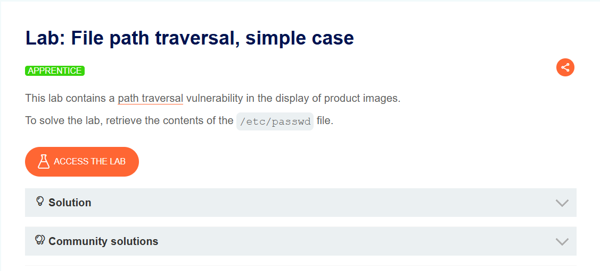
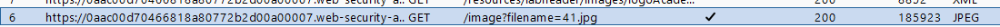
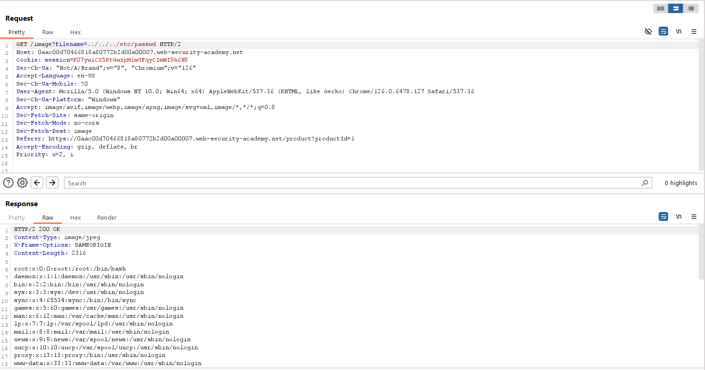

## File path traversal, simple case
***

Ứng dụng web load ảnh của các post thông qua tham số filename.

Truy cập đường dẫn load ảnh của post bất kì. Ảnh này có vẻ nằm ở đường dẫn /var/www/html (web root directory của Linux).

Thay đổi tham số filename thành ../../../etc/passwd để traverse về thư mục root và truy cập file /etc/passwd.

