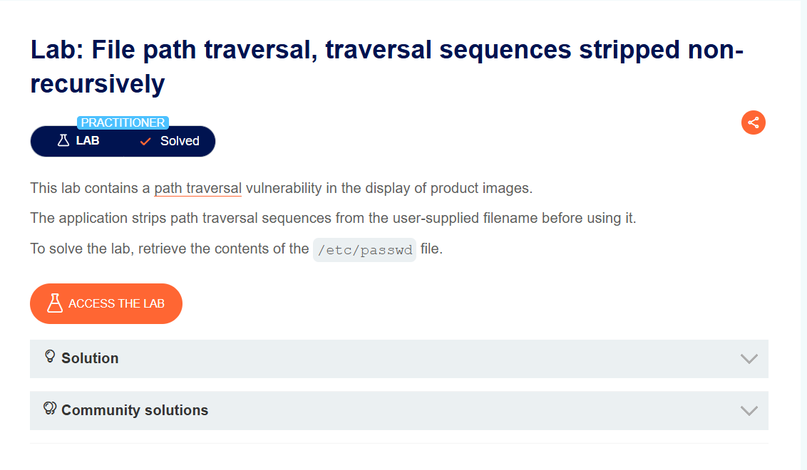
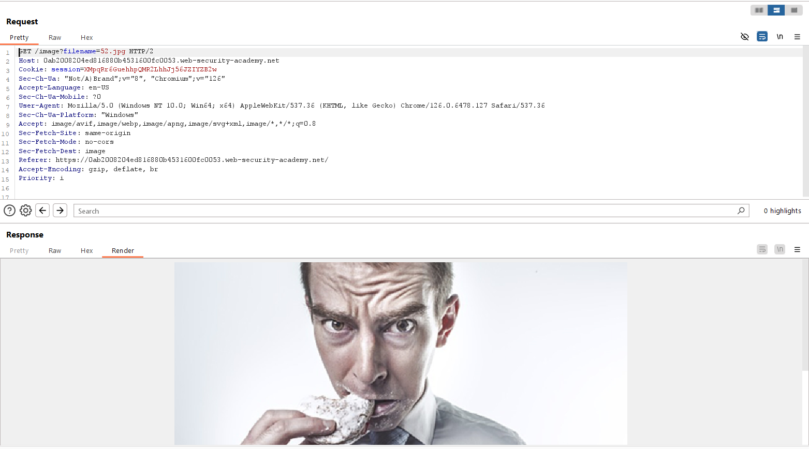
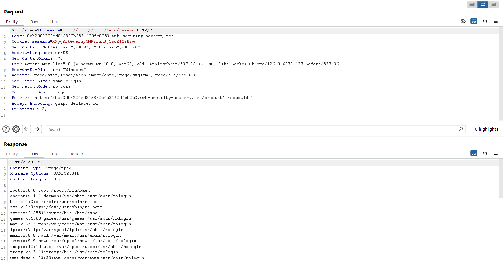

## File path traversal, traversal sequences stripped non-recursively
***

Ứng dụng web load ảnh của các post thông qua tham số filename và ta lại khai thác lỗ hổng File path traversal ở tham số này.
Comment

Khi traverse bằng ../../../etc/passwd thì bị trả về 400 bad request. Lí do là do ứng dụng đã xóa ../ nếu nó xuất hiện trong param filename.

Tuy nhiên, theo mô tả thì nó làm việc đó không triệt để. Cụ thể, với ....// thì nó sẽ chỉ xóa ../ ở giữa, và kết quả vẫn còn lại ../ → ta có thể bypass để traverse. Sử dụng payload ....//....//....//etc/passwd ta sẽ đọc được nội dung file /etc/passwd thành công.

