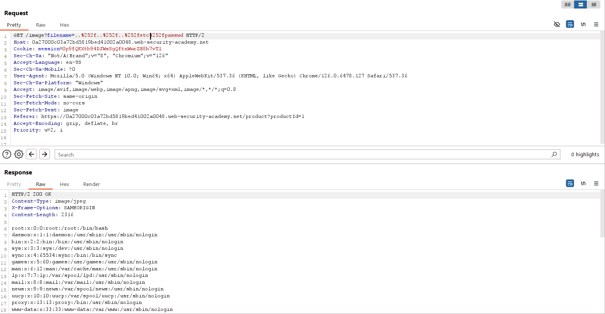

## File path traversal, traversal sequences stripped with superfluous URL-decode
***

Ứng dụng web load ảnh của các post thông qua tham số filename và ta lại khai thác lỗ hổng File path traversal ở tham số này.

Khi traverse bằng ../../../etc/passwd thì bị trả về 400 bad request → ứng dụng chặn ../ để traverse.
Thử encode URL kí tự / thành %2f, kết quả cũng trả về 400 do có thể web browser đã decode trước và server vẫn hiểu đó là /

Nếu đọc kĩ mô tả, có vẻ như server còn có 1 bước URL decode nữa sau khi check ../ → Nếu ta double encoding ../ -> ..%2f -> ..%252f thì khi submit request, server sẽ hiểu ..%252f thành ..%2f, và cái này trải qua một bước URL decode nữa sẽ thành ../ → Ta bypass thành công và xem được nội dung file /etc/passwd với payload như hình dưới.

