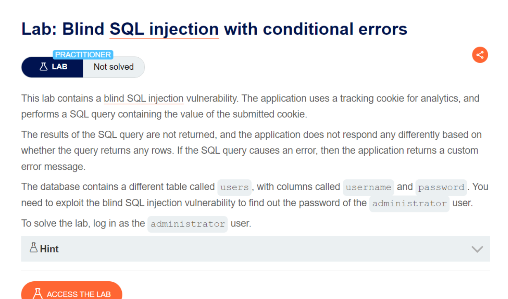

# Blind SQL injection with conditional errors
***

+ Lab này có chứa lỗ hổng Blind SQL Injection, Ứng dụng sử dụng cookie theo dõi để phân tích và thực hiện truy vấn SQL chứa giá trị của cookie đã gửi. Kết quả của truy vấn SQL không được trả về và không có thông báo lỗi nào được hiển thị. Nhưng bất kỳ câu lệnh nào không được thực thi thì chương trình sẽ báo lỗi.

+ Theo như dữ liệu của bài lab chúng ta có một bảng trong database là users và 2 cột là username và password. Mục tiêu của bài lab này là khai thác lỗ hổng blind sql injection để tìm ra được password của tài khoản administrator và đăng nhập với tư cách là administrator

+ Đầu tiên, ta sửa đổi cookie TrackingId, thêm một dấu ' vào nó
  
File: [solve.py](./solve.py)