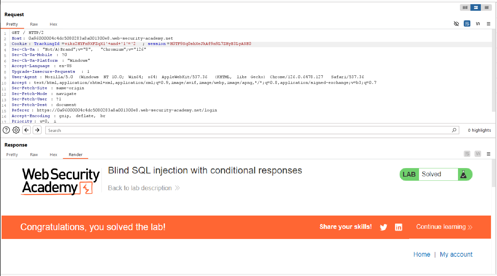

# Blind SQL injection with conditional responses
***


+ Lab này có chứa lỗ hổng Blind SQL Injection, Ứng dụng sử dụng cookie theo dõi để phân tích và thực hiện truy vấn SQL chứa giá trị của cookie đã gửi. Kết quả của truy vấn SQL không được trả về và không có thông báo lỗi nào được hiển thị. Tuy nhiên, ứng dụng sẽ bao gồm thông báo "Welcome back" trong trang nếu truy vấn trả về bất kỳ hàng nào.

+ Theo như dữ liệu của bài lab chúng ta có một bảng trong database là users và 2 cột là username và password. Mục tiêu của bài lab này là khai thác lỗ hổng blind sql injection để tìm ra được password của tài khoản administrator và đăng nhập với tư cách là administrator

+ Đầu tiên ta sẽ chèn vào trang web câu truy vấn luôn đúng và câu lệnh luôn sai để xem phản ứng của trang web




+ Ta nhận thấy khi chèn vào trang web câu 1 câu truy vấn, nó sẽ trả về Welcome back nếu câu truy vấn đó là đúng và không phản hồi lại gì nếu nó là sai. Ta biết được username là administrator, bây giờ ta cần đi kiểm tra độ dài của mật khẩu bằng câu lệnh :```AND (Select 'a' from users where username = 'administrator' and length(password) = $X) = 'a'```
+ Như vậy ta tìm được độ dài của mật khẩu là: 20. Tiếp theo ta sẽ đi dò từng ký tự của mật khẩu bằng [solve.py](./test.py)