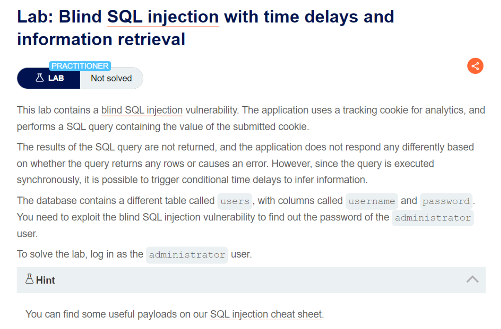

# Blind SQL injection with time delays and information retrieval
***


+ Lab chứa lỗ hổng SQL SQL. Ứng dụng sử dụng cookie theo dõi để phân tích và thực hiện truy vấn SQL chứa giá trị của cookie đã gửi. Kết quả của truy vấn SQL không được trả về và ứng dụng không phản hồi theo bất kỳ cách nào khác nhau dựa trên việc truy vấn trả về bất kỳ hàng nào hay gây ra lỗi. Tuy nhiên, do truy vấn được thực hiện đồng bộ nên có thể kích hoạt độ trễ thời gian có điều kiện để suy ra thông tin. Database có một bảng là users và 2 cột là username và password

+ Mục tiêu là tìmd được mật khẩu của administrator và đăng nhập vào

+ Đầu tiên ta thử phản hồi của trang web khi thêm 1 câu truy vấn gây ra độ trễ thời gian

```|| ( select case when (1=1) then pg_sleep(10) else pg_sleep(0) end) -- ```

FILE: [solve.py](./solve.py)