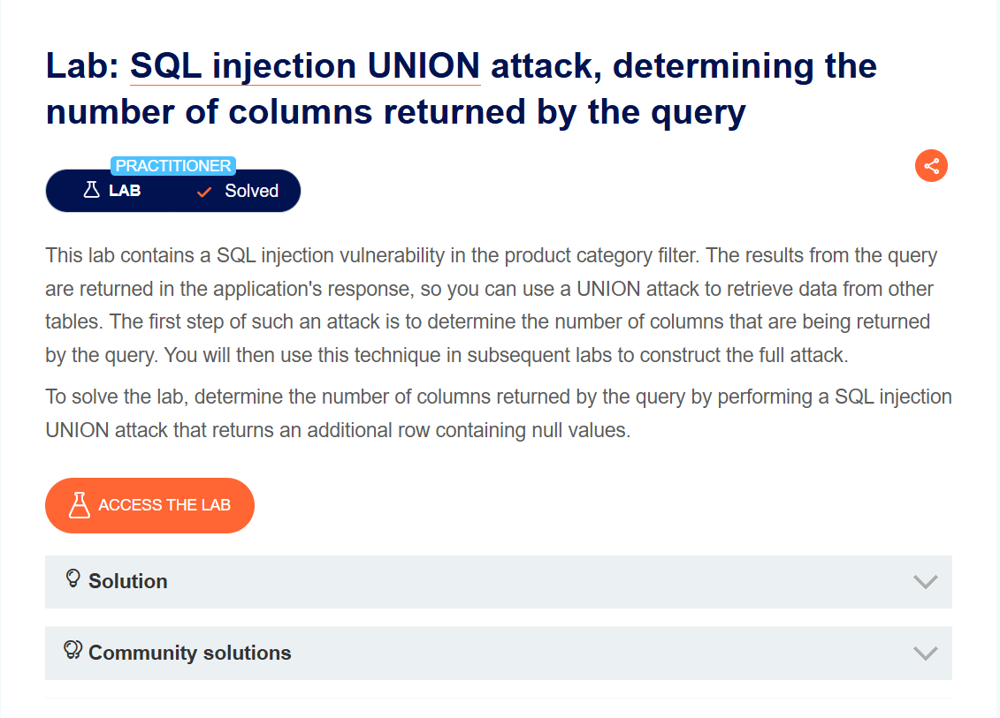
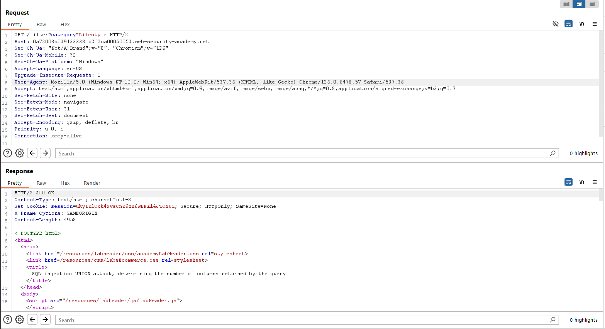
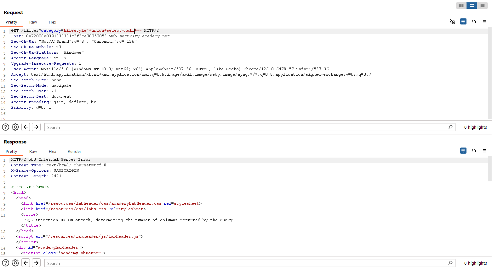
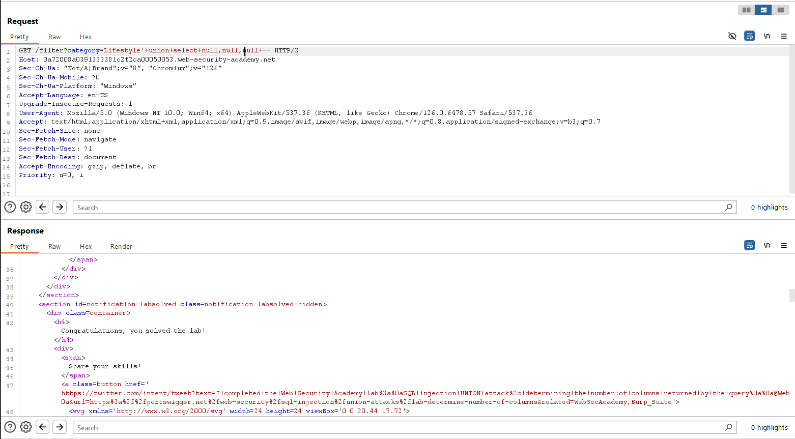

# SQL injection UNION attack, determining the number of columns returned by the query
***

Lab trên chứa lỗ hổng sql injection trong bộ lọc category, và kết quả truy vấn sẽ được trả về trong phản hồi của ứng dụng. Vì vậy tôi có thể sử dụng tấn công UNION để truy xuất dữ liệu từ các bảng khác.

Mục tiêu của bài lab này là xác định số lượng cột được truy vấn trả về vì vậy tôi sẽ dùng kiểu tấn công union để xác định số cột

select ? from table1 union select null

Ở đây, table 1 là bảng tôi cần xác định số cột, vì chưa biết số cột là bao nhiêu nên tôi sẽ để nó là ?, tôi sẽ thêm lần lượt các giá trị NULL. Nếu số cột không đúng nó sẽ báo lỗi, ngược lại số cột table1 trùng với số giá trị NULL thì chúng ta sẽ xác định được số cột của bảng table1

Đầu tiên, tôi sẽ dùng công cụ burp suite đưa filter category vào repeater

Tiếp theo tôi sẽ thêm phần tham số của filter?category=Gifts là: '+union+select+null–

Với dấu ' là để ngắt input vào tham số accesories, UNION SELECT để khởi tạo UNION và thêm 1 số NULL, đồng thời chú thích để ngắt những câu lệnh đằng sau:

Tôi thu được kết quả là lỗi server: Internal Server Error, điều đó chứng tỏ số cột của table1 không phải là 1, tôi tiếp tục thêm null vào cho đến giá trị null thứ 3 thì câu lệnh query trả về 3 giá trị của bảng table1

Như vậy, tôi biết được số cột cần tìm là 3 và bài lab đã được giải quyết