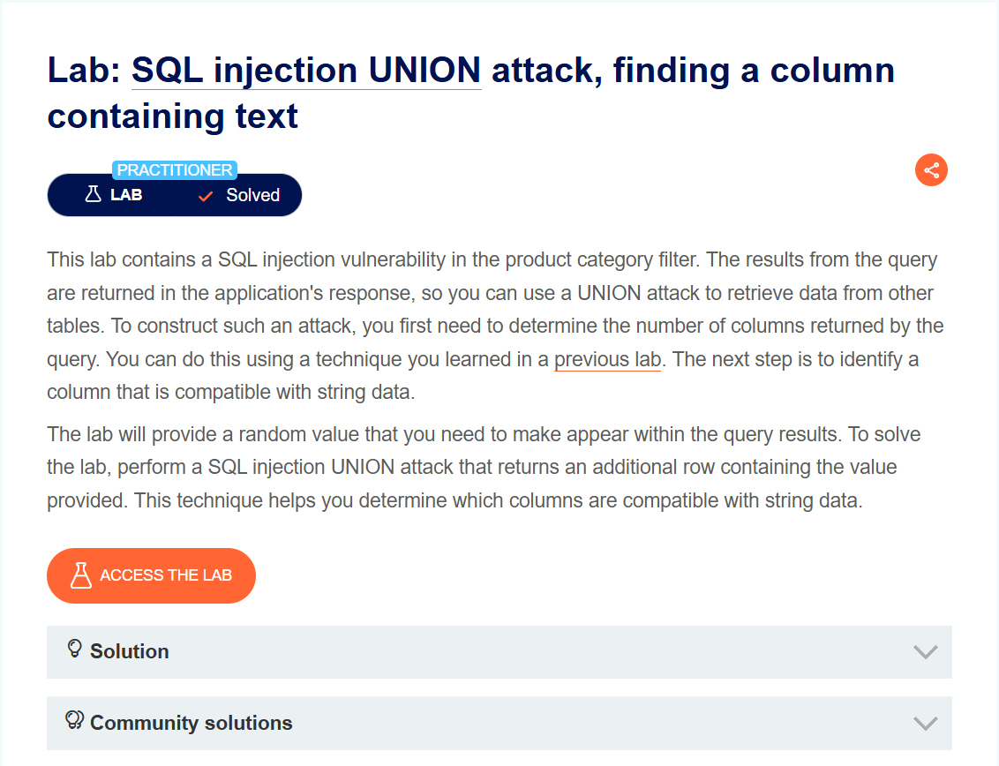
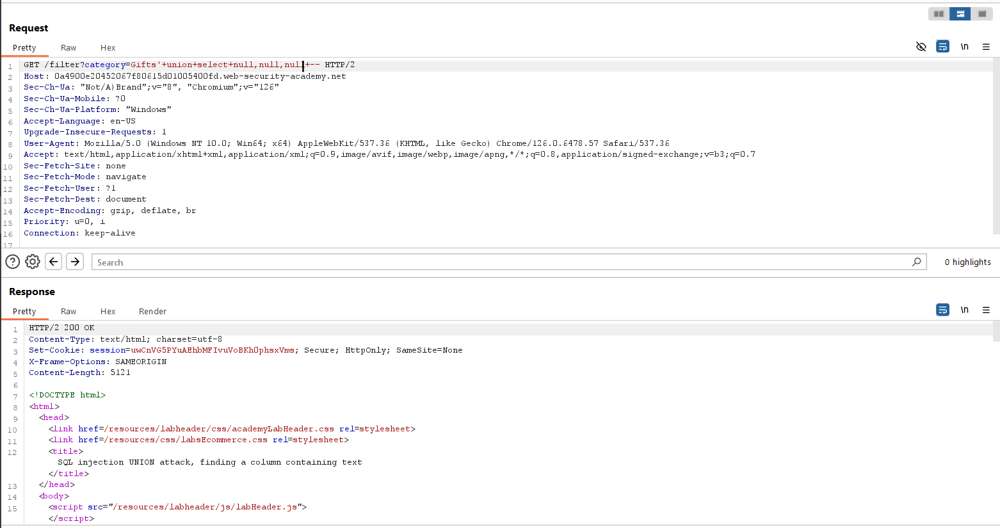
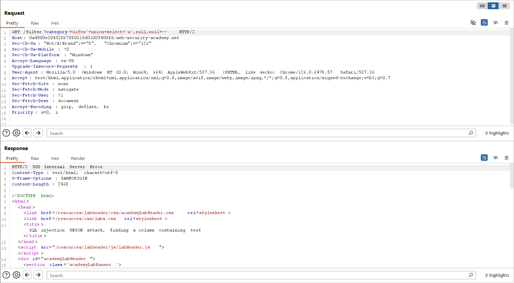
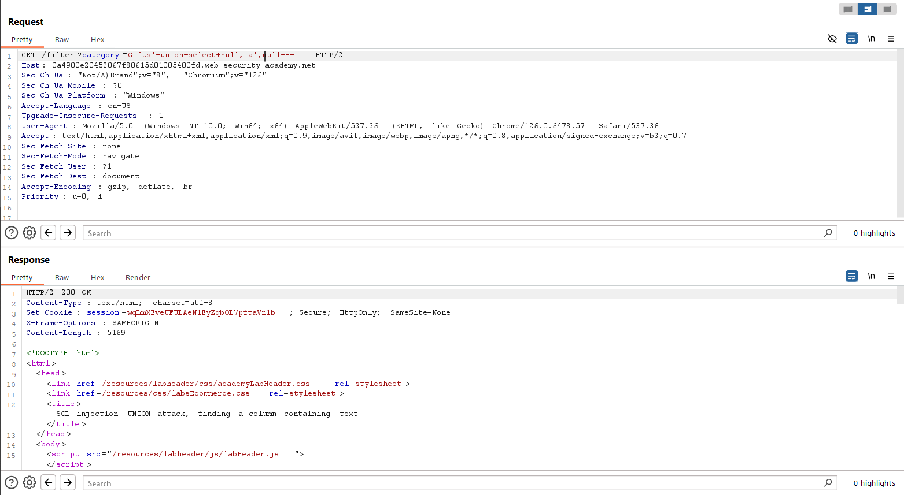
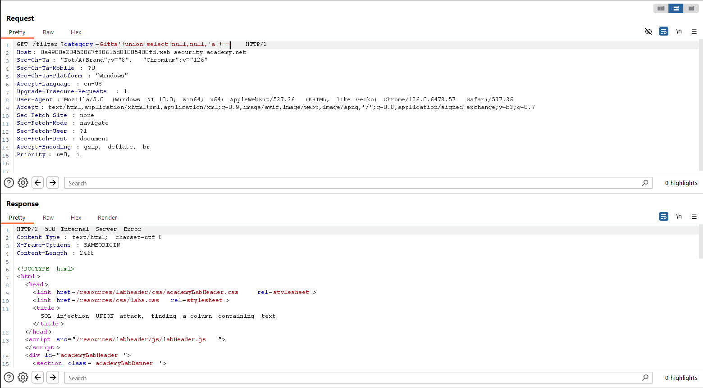
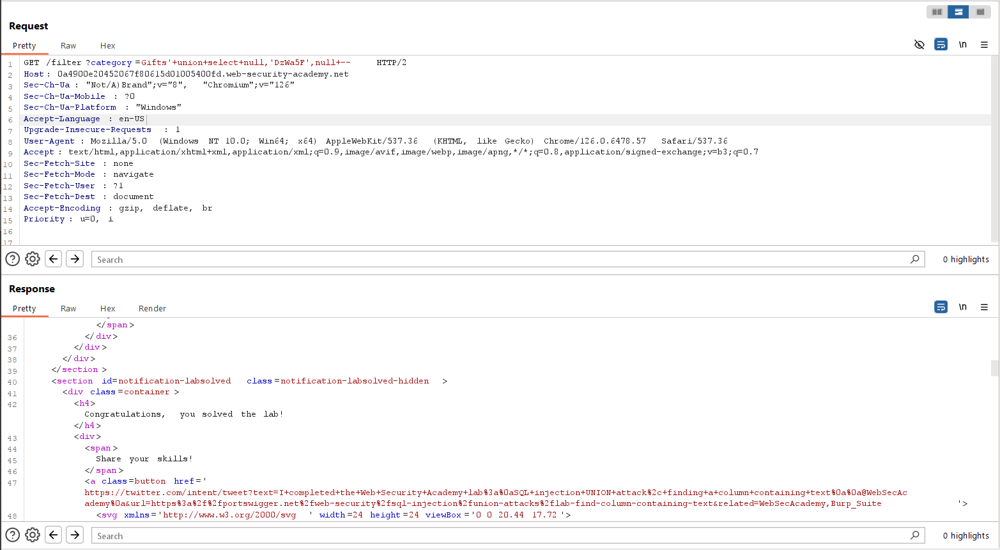

# SQL injection UNION attack, finding a column containing text
***

+ Lab trên chứa lỗ hổng sql injection trong bộ lọc category
+ Mục tiêu của lab này là tìm ra cột có kiểu dữ liệu là string trong query trả về
+ Đầu tiên, bằng kỹ thuật của lab trước ta xác định được số cột trả về của câu lệnh query là 3

+ Tiếp theo ta thay lần lượt các giá trị null bằng 1 chuỗi có kiểu dữ liệu là string để xác định cột nào trong query trả về là string

***

***

Như vậy sau ba lần thử ta thu được kiểu dữ liệu ở cột 2 là string. Ta sẽ thay string lab cung cấp vào cột 2

