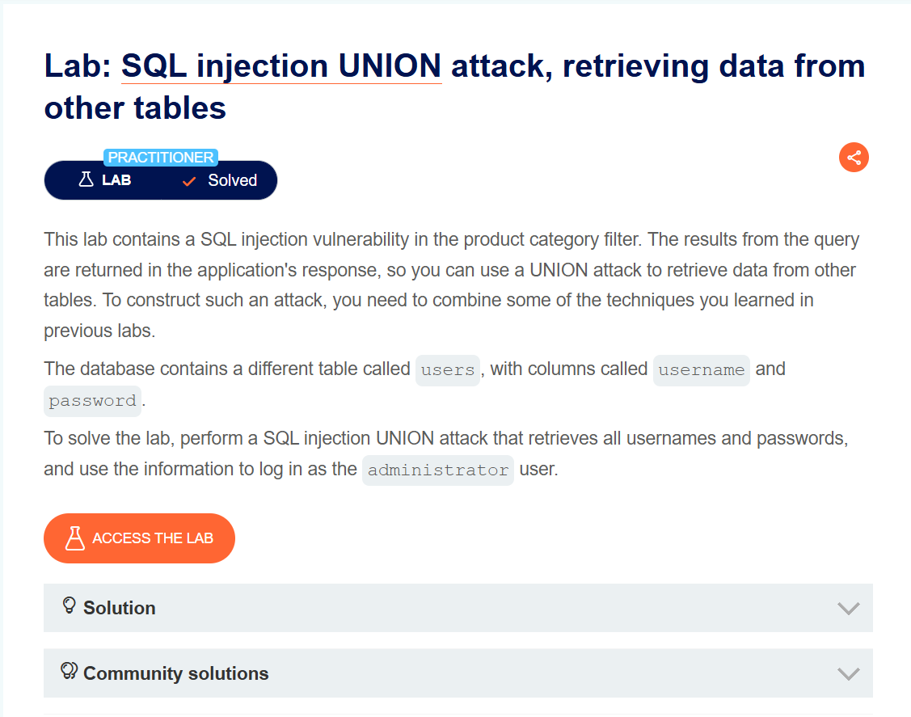
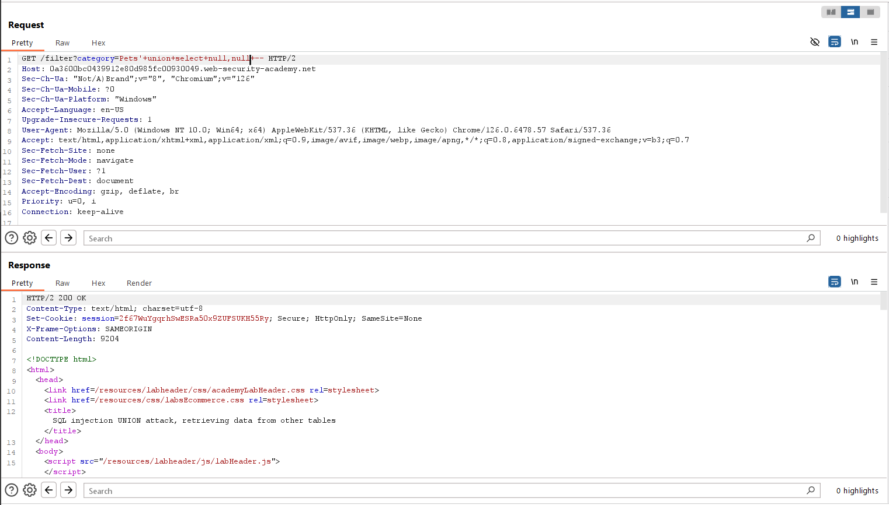
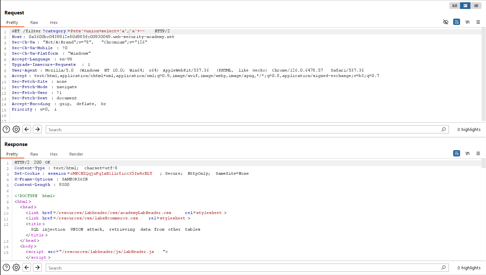
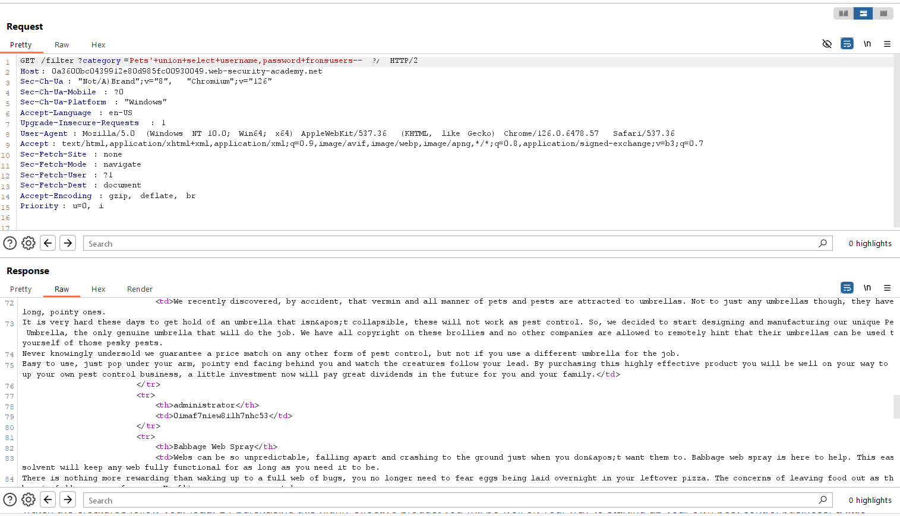

# SQL injection UNION attack, retrieving data from other tables
***


+ Lab trên chứa lỗ hổng sql injection trong bộ lọc category

+ Mục tiêu: truy xuất tất cả username và password, đồng thời sử dụng thông tin để đăng nhập với tư cách administrator.

+ Đầu tiên ta sẽ xác định số cột trả về của query:
  


Ta thu được số cột là 2, tiếp theo ta sẽ kiểm tra cột nào có kiểu dữ liệu là string trong query:



Sau khi thu được kết quả là cả 2 cột của query đều là kiểu dữ liệu string, ta tiến hành lấy username và password của bảng users bằng câu lệnh:

```UNION SELECT username, password FROM users```



+ Ta thu được 3 tài khoản:
Username: carlos password: pvgpp9o6trxpr93ahccn
Username: wiener password: wbdwdd8pkp9lt5umm54o
Username: administrator password: 0qr272qw91l66n6acds8