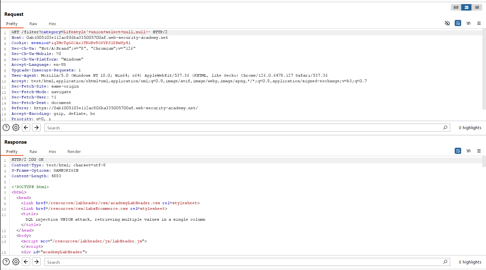
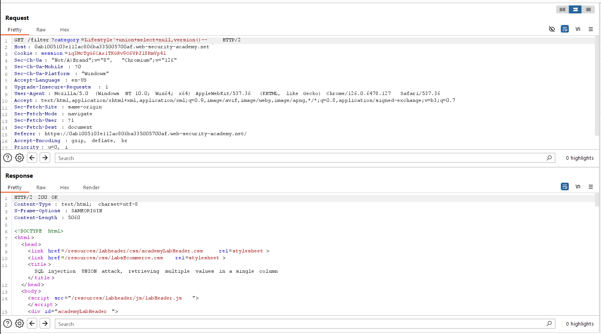

# SQL injection UNION attack, retrieving multiple values in a single column
***


+ Lab trên chứa lỗ hổng sql injection trong bộ lọc category
+ Mục tiêu: truy xuất tất cả username và password, đồng thời sử dụng thông tin để đăng nhập với tư cách administrator.
+ Đầu tiên ta sẽ xác định số cột trả về của query:



+ Ta thu được số cột là 2, tiếp theo ta sẽ kiểm tra cột nào có kiểu dữ liệu là string trong query:


+ Vật là sau 2 lần thử ta biết được kiểu dữ liệu của cột 2 trong câu lệnh query là kiểu dữ liệu string
+ Tiếp theo ta tiến hành lấy thông tin username và password của bảng users
+ Ở đây đề bài có gợi ý chúng ta tham khảo [SQL injection cheat sheet](https://portswigger.net/web-security/sql-injection/cheat-sheet) , ta biết được cách nối các chuỗi:
  


+ Việc tiếp theo chúng ta cần làm là đi xác định xem loại database mà lab đang sử dụng là gì:




+ May mắn là sau 2 lần thử ta tìm được loại database đang sử dụng là: PostgreSQL. Vì vậy ta sử dụng câu lệnh ```UNION SELECT null, username||'*'||password from users``` để lấy ra thông tin tài khoản và mật khẩu của bảng users và dùng kí tự '*' để phân cách username và password:


+ Vậy là ta thu được thông tin username và password của bảng users