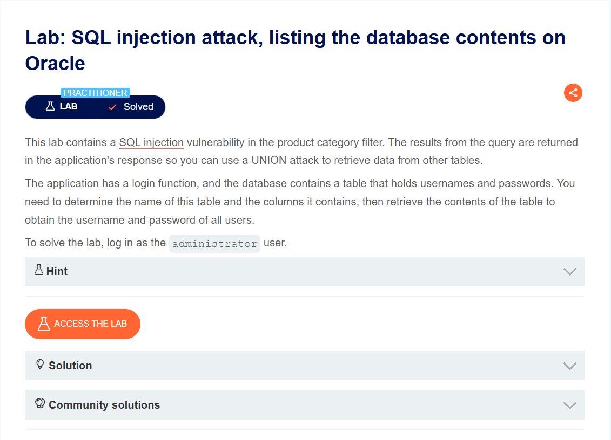
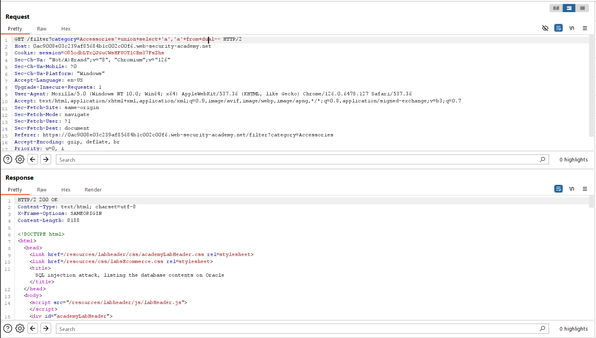
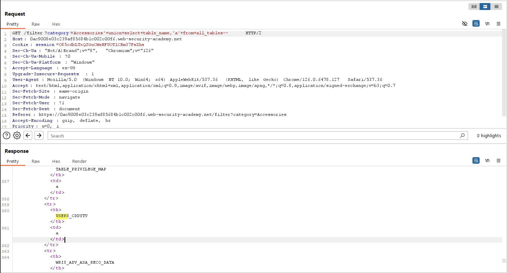
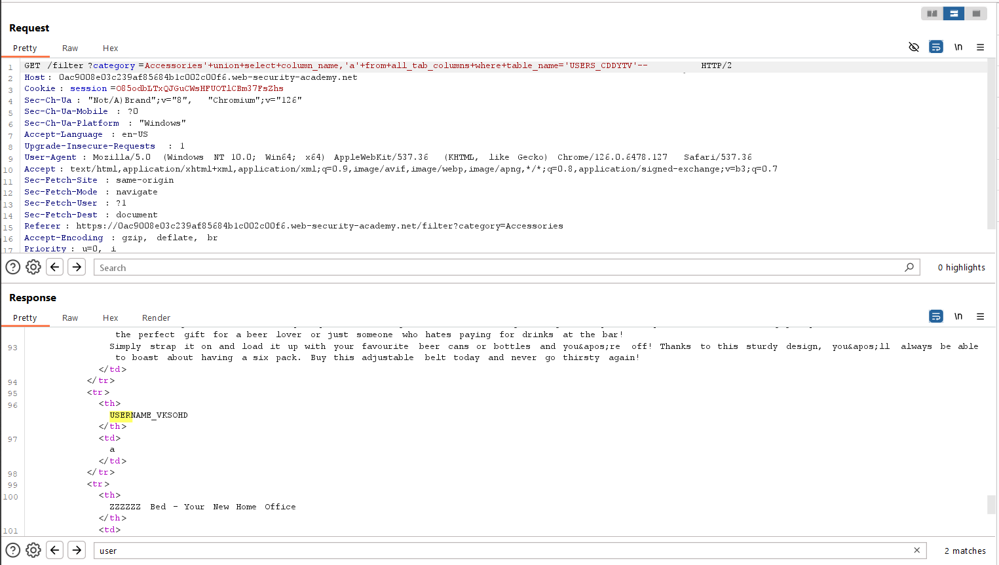
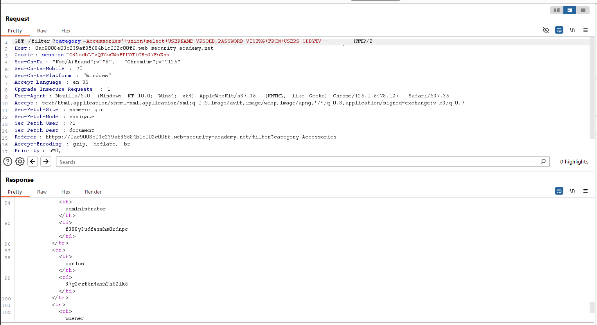

# SQL injection attack, listing the database contents on Oracle
***


+ Lab trên chứa lỗ hổng sql injection trong bộ lọc category

+ Mục tiêu của bài lab này là xác định tên của bảng này và các cột chứa trong đó, sau đó truy xuất nội dung của bảng để lấy username và password của tất cả người dùng. Cuối cùng đăng nhập với tư cách là administrator

+ Đầu tiên ta sẽ xác định số cột và xem cột nào có kiểu dữ liệu là string:



+ Ta thu được số cột trả về là 2 và kiểu dữ liệu của 2 cột đều là string. Theo như thông tin bài lab đã cho database ở đây là oracle, do đó ta sẽ dùng câu lệnh:```UNION SELECT table_name,null FROM all_tables``` để truy xuất ra các bảng có trong database



+ Ta nhận được 1 bảng có tên là USERS_CDDYTV. Ta sẽ tiếp tục tìm kiếm thông tin username và password ở bảng USERS_CDDYTV:```UNION SELECT column_name, null FROM all_tab_columns WHERE table_name = 'USERS_CDDYTV'```



Ta nhận được 2 cột có tên là USERNAME_VKSOHD và PASSWORD_VISTXG, tiếp theo ta sẽ đi tiến hành lấy thông tin username và password của các tài khoản trong bảng USERS_CDDYTV dựa vào 2 cột trên



+ Như vậy ta tìm được 3 tài khoản với username và password là:
Username: administrator password: f388y3udfszshs0rdnpc
Username: carlos password: 87g2czfkn4azh2h62ik6
Username: wiener password: vjhcom1we51ml63ykp9c