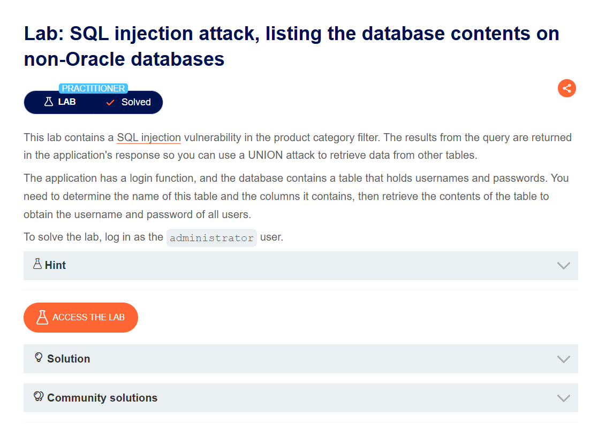
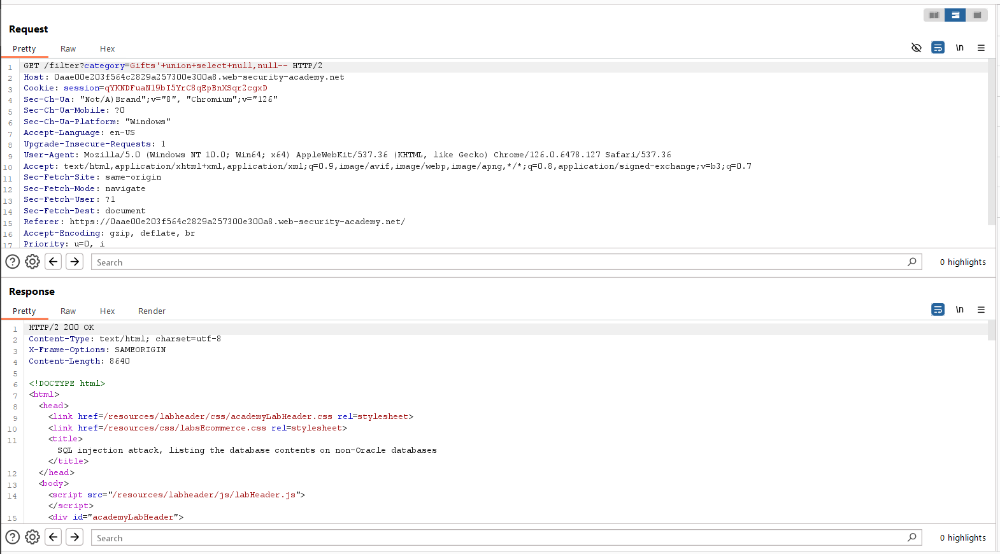
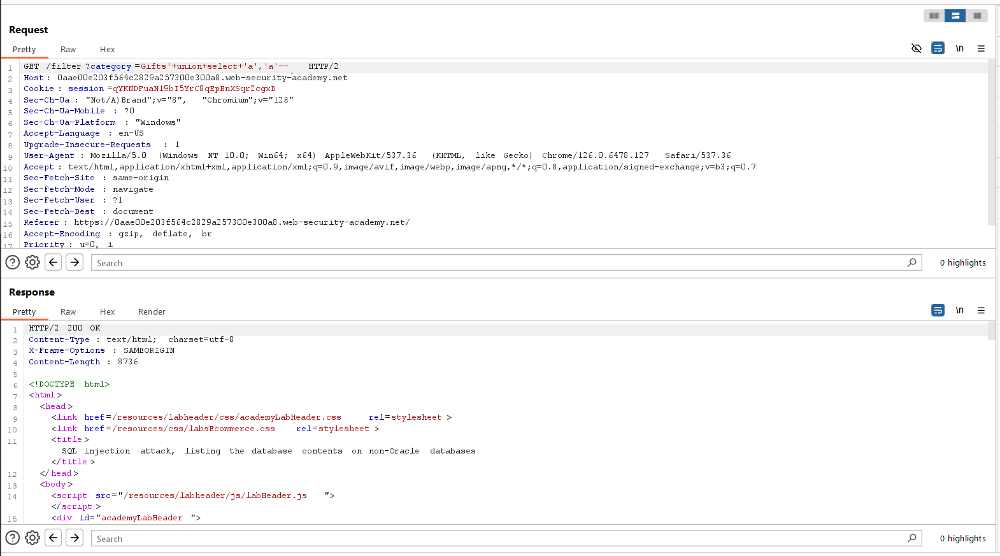
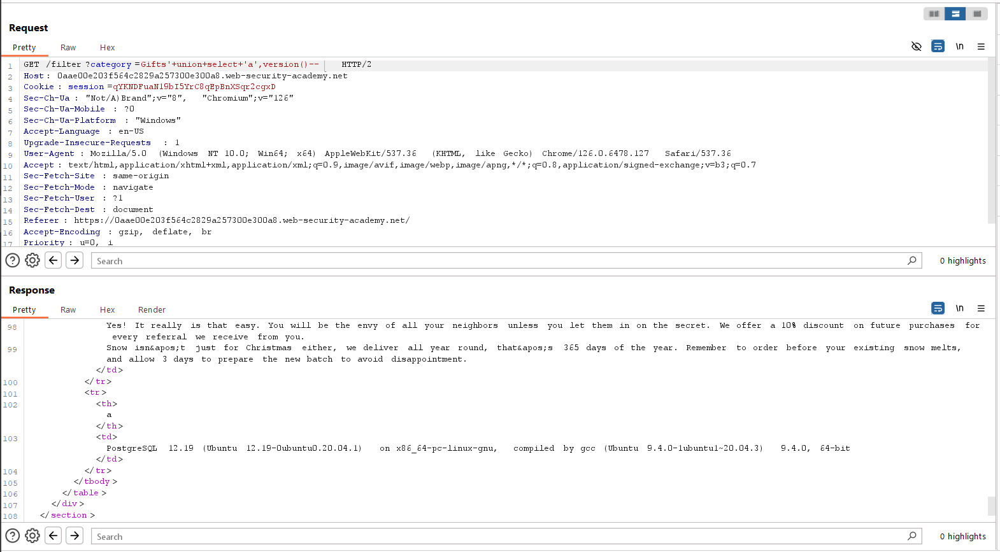
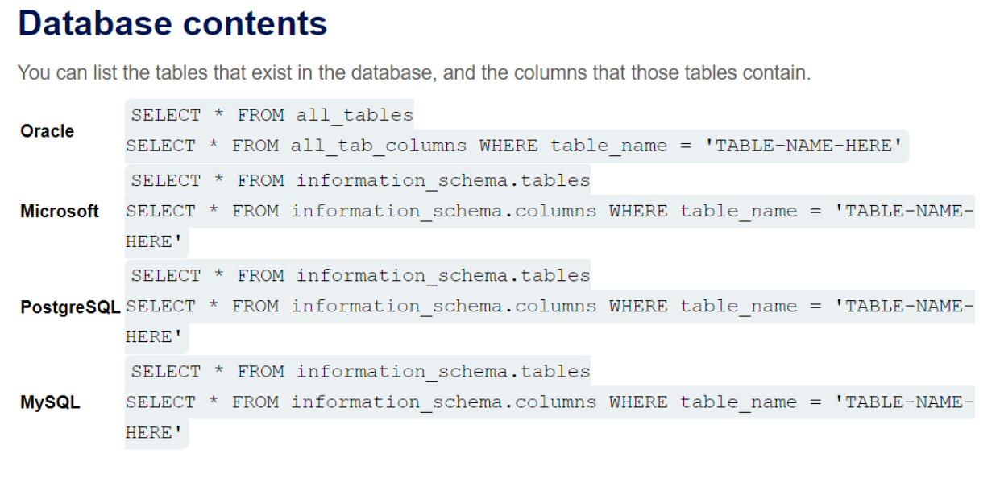
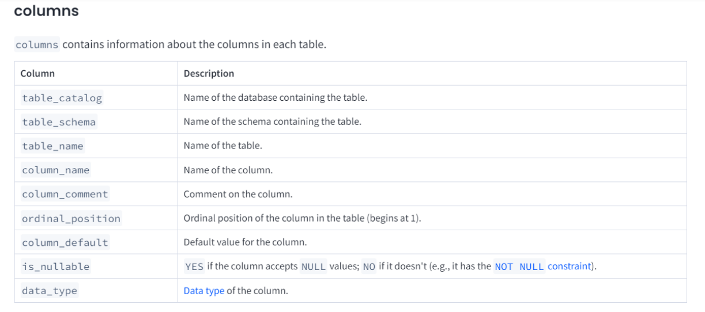
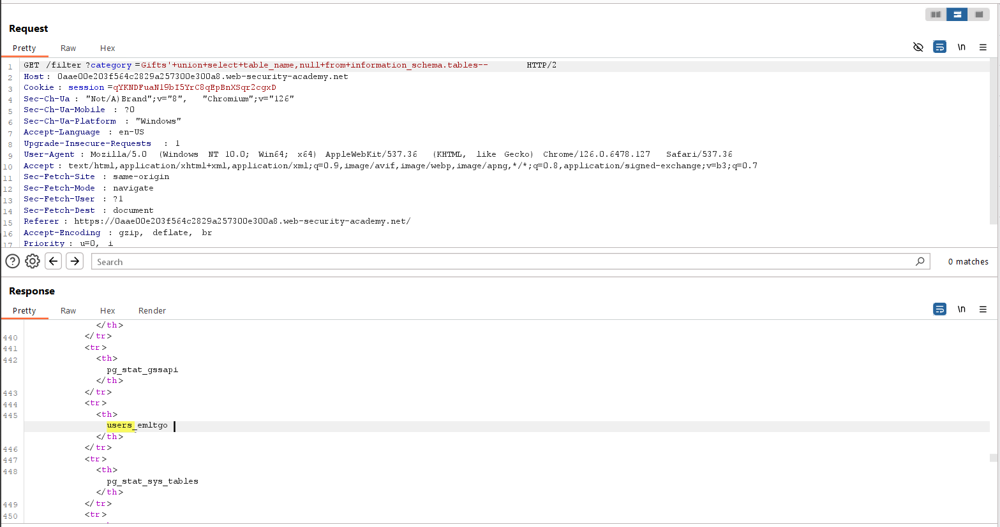
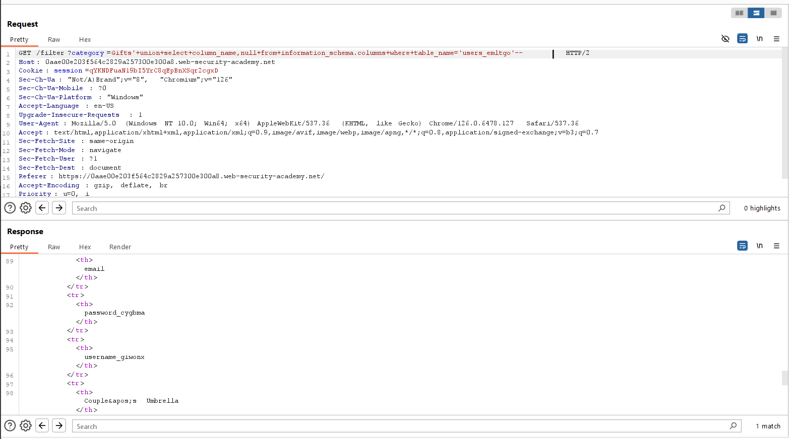
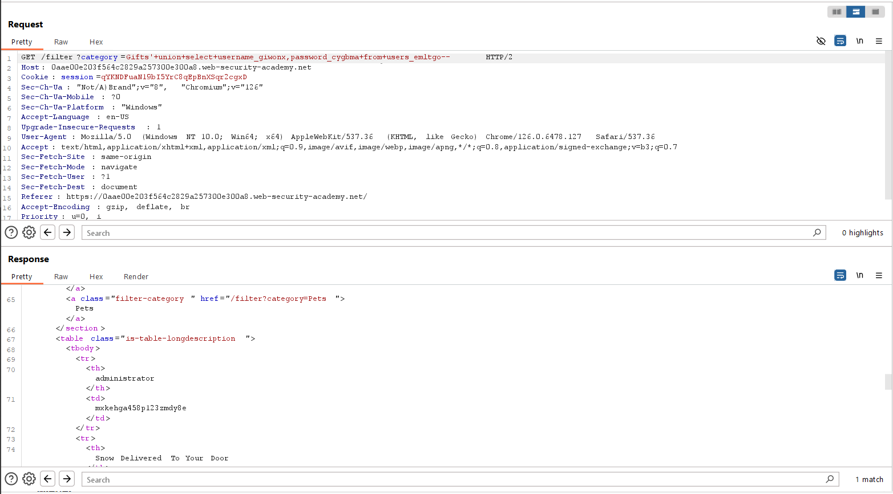
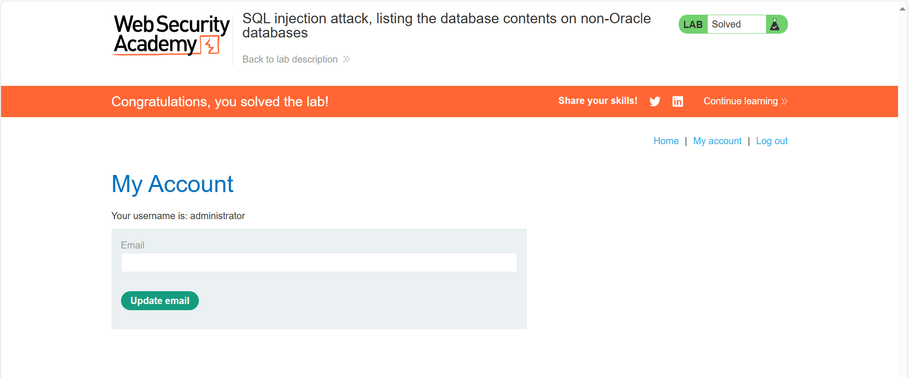

# SQL injection attack, listing the database contents on non-Oracle databases
***


+ Lab trên chứa lỗ hổng sql injection trong bộ lọc category

+ Mục tiêu của bài lab này là xác định tên của bảng này và các cột chứa trong đó, sau đó truy xuất nội dung của bảng để lấy username và password của tất cả người dùng. Cuối cùng đăng nhập với tư cách là administrator

+ Đầu tiên ta sẽ xác định số cột và xem cột nào có kiểu dữ liệu là string:





+ Ta thu được số cột của query là 2 và 2 cột đều có kiểu dữ liệu là string, tiếp theo ta sẽ đi xác định loại database mà web đang sử dụng và phiên bản của nó :



+ Ta biết được loại database ở đây là PostgreSQL từ đó ta có thể liệt kê các bảng trong database và các cột trong bảng:





+ Để lấy tên các bảng trong databaseta sử dụng câu lệnh ```UNION SELECT table_name,null FROM information_schema.tables```



+ Sau khi đã có được các bảng trong database ta tìm được 1 bảng chưa các thông tin người dùng là users_emltgo . Sau đó, ta sẽ tiếp tục tìm các cột có chưa thông tin username và password trong bảng users_emltgo 
  ```UNION SELECT column_name, null FROM information_schema.columns WHERE table_name = 'users_emltgo'```



+ May mắn là ta tìm được 2 cột có tên là username_giwonx và password_cygbma. Từ đó ta sẽ đi truy xuất username và password của bảng users_emltgo



Ta thu được password của administrator là: mxkehga458p123zmdy8e

