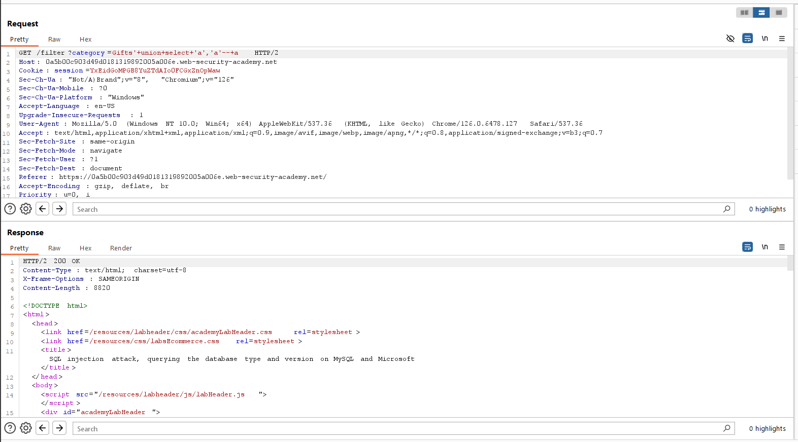

# SQL injection attack, querying the database type and version on MySQL and Microsoft
***


+ Lab trên chứa lỗ hổng sql injection trong bộ lọc category
+ Mục tiêu của bài lab này hiển thị chuỗi phiên bản của database
+ Tương tự như lab trước, ta cũng sẽ đi xác định số cột và kiểu dữ liệu của cột nào trả về là string




+ Ta xác định được số cột là 2 và cột 1 trả về kiểu dữ liệu string, tiếp theo ta sẽ dụng câu lệnh ```UNION SELECT @@version, null``` để xác định phiên bản database của trang web
  


version: *8.0.37-0ubuntu0.20.04.3*