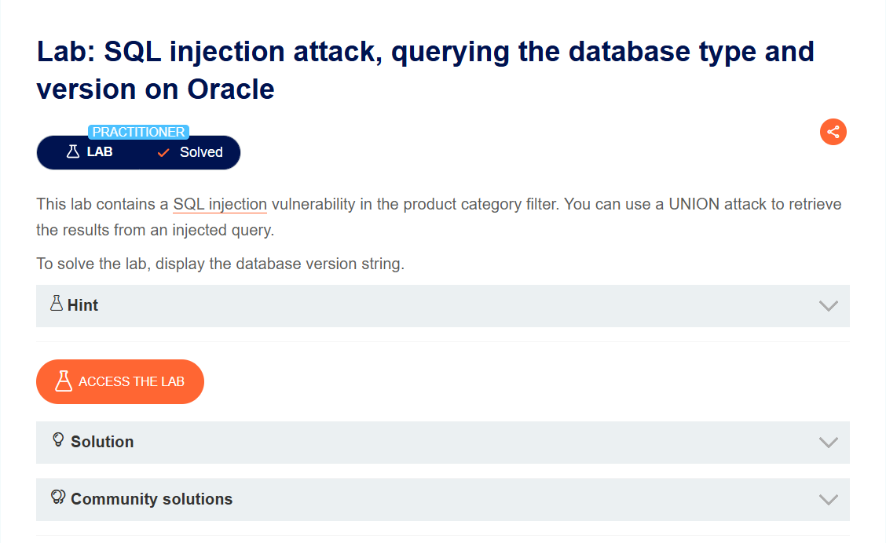
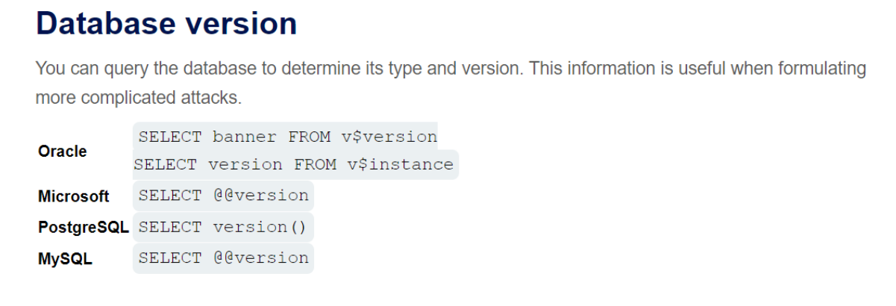
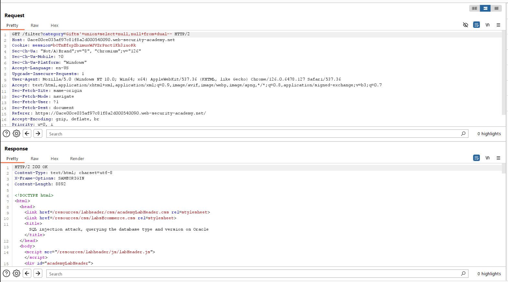
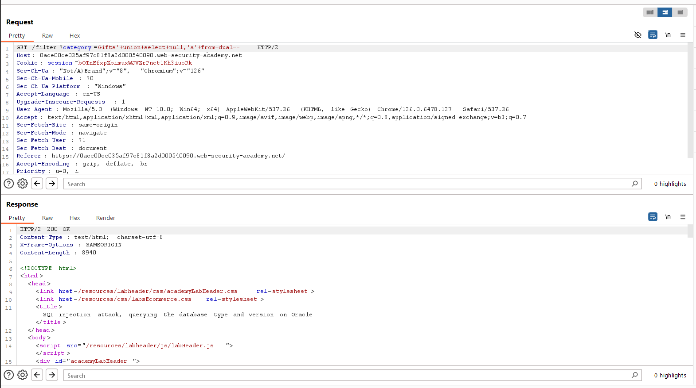
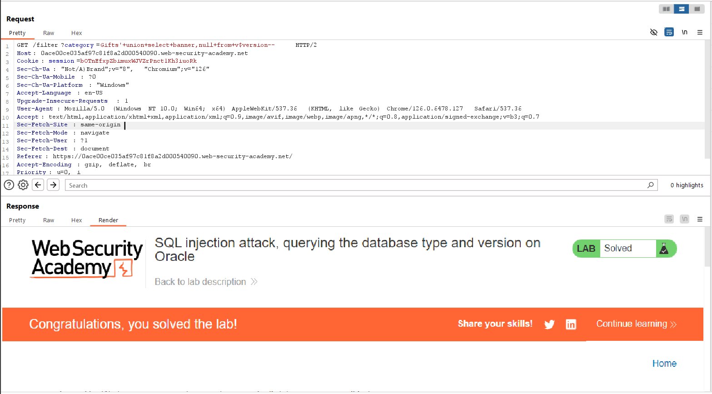

# SQL injection attack, querying the database type and version on Oracle
***


+ Lab trên chứa lỗ hổng sql injection trong bộ lọc category

+ Mục tiêu của bài lab trên hiển thị chuỗi phiên bản của database

+ Ở đây đề bài có gợi ý chúng ta tham khảo [SQL injection cheat sheet](https://portswigger.net/web-security/sql-injection/cheat-sheet), từ đó ta biết được cách xác định phiên bản của database bằng cách sau:



+ Đầu tiên ta sẽ xác định số cột của kết quả query trả về. Trên cơ sở dữ liệu Oracle, mọi câu lệnh SELECT phải chỉ định một bảng để chọn FROM. Nếu cuộc tấn công UNION SELECT của bạn không truy vấn từ một bảng, bạn vẫn cần bao gồm từ khóa FROM theo sau là tên bảng hợp lệ. Có một bảng tích hợp sẵn trên Oracle có tên là dual mà bạn có thể sử dụng cho mục đích này nên ta sẽ sử dụng ```UNION SELCT null FROM DUAL``` để xác định số cột của query:



+ Từ đó ta xác định được số cột là 2, tiếp theo ta sẽ xem xét 2 cột trả về cột nào sẽ trả về kiểu dữ liệu là string




+ Chúng ta biết được 2 cột đều mang giá trị string nên ta có thể trỏ câu lệnh ```SELECT banner FROM v$version``` vào bất kỳ cột nào để xác định phiên bản của database, ở đây ta sẽ chọn cột 1

