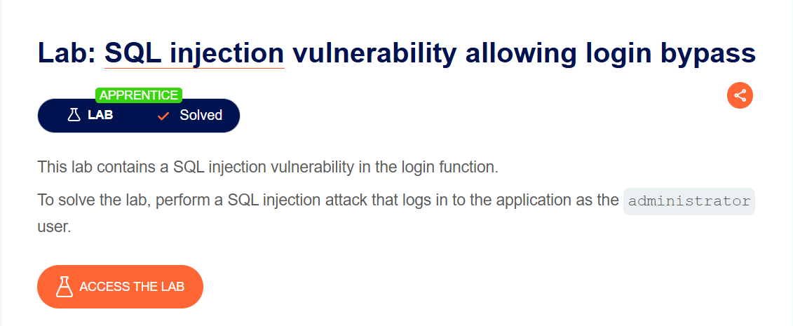

# SQL injection vulnerability allowing login bypass
***


Lab này yêu cầu tôi thực hiện tấn công sql injection để đăng nhập vào ứng dụng với tài khoản administrator

Vì nó là chức năng đăng nhập nên câu lệnh truy vấn sql của nó là một cái gì đó tương tự câu lệnh truy vấn

```sql
SELECT FIRSTNAME FROM USERS WHERE USER = 'ADMINISTRATOR' AND PASSWORD = 'PASSWORD'
```
Vì đề bài yêu cầu đăng nhập với tư cách administrator nên tôi sẽ thực hiện tấn công sql injection vào tài khoản : administrator'--
Ở đây câu lệnh truy vấn sql sẽ tương tự

```sql
SELECT FIRSTNAME FROM USER WHERE USER = 'ADMINISTRATOR' -- a
```
nó sẽ đăng nhậo vào tài khoản administrator và tự động bỏ qua trường mật khẩu


Như vậy bài lab đã được giải quyết

