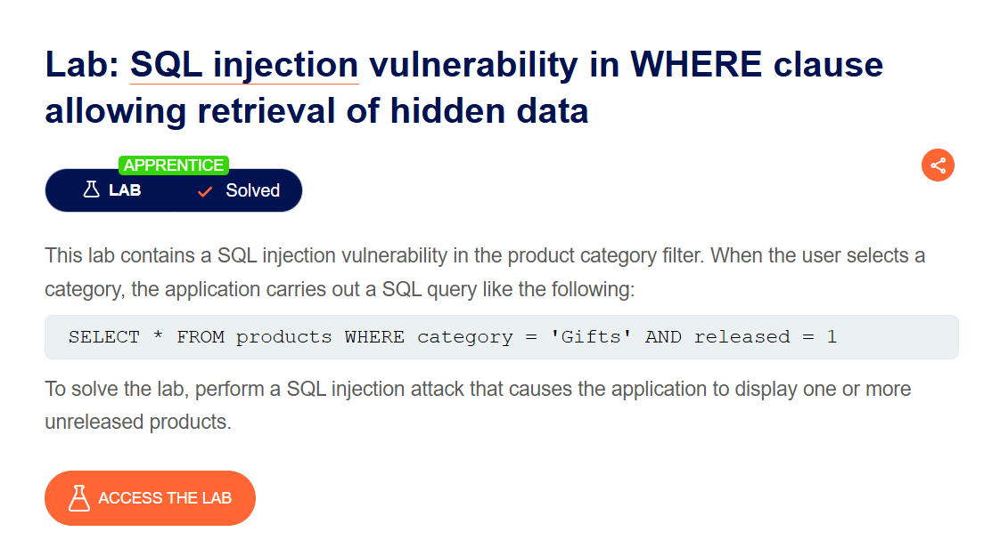
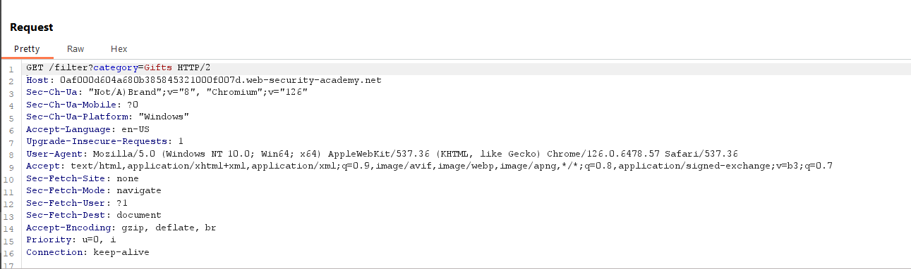
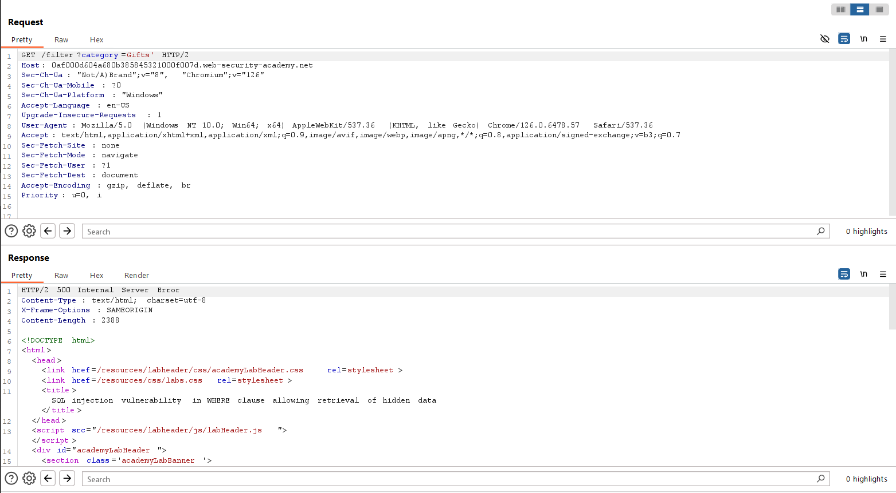
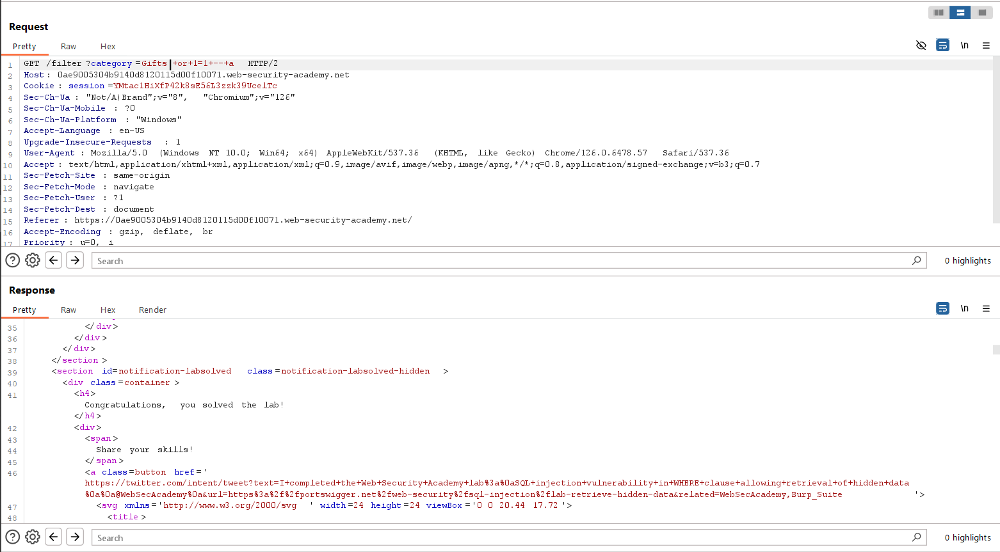

# SQL injection vulnerability in WHERE clause allowing retrieval of hidden data
***

Lab này yêu cầu tôi thực hiện tấn công sql injection để hiển thị một hay nhiều sản phẩm chưa được phát hành

Theo như để bài nơi tấn công injection là bộ lọc danh mục sản phẩm, do đó tôi sẽ sử dụng công cụ Burp Suite để bắt lấy request của category:

Đầu tiên, tôi thêm một kí tự sql đặc biệt dễ phá vỡ câu lệnh truy vấn, ở đây tôi thêm dấu ', thì ta nhận thu được lỗi Internal Server Error

Tiếp theo, tôi sẽ chèn thêm 1 phần tử luôn đúng 1 = 1 vào , khi đó câu lệnh Select * sẽ chọn hết tất cả sản phẩm từ bảng Products mà không cần quan tâm đến sự phân loại của category và sau đó ta sẽ sử dụng dấu –- để bỏ qua tất cả câu lệnh phía sau:

