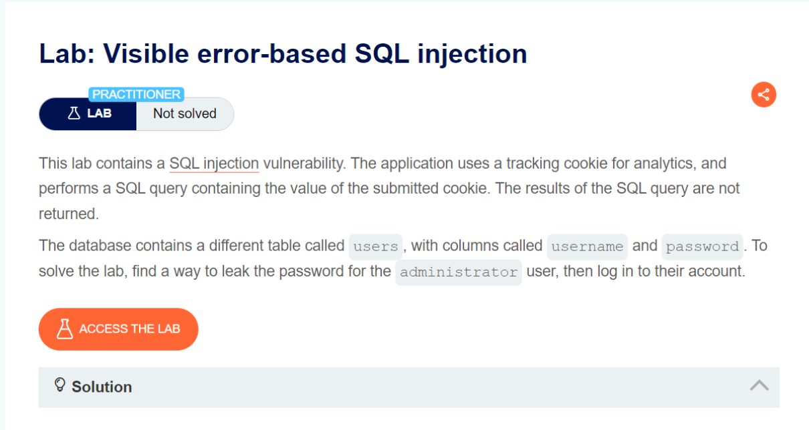
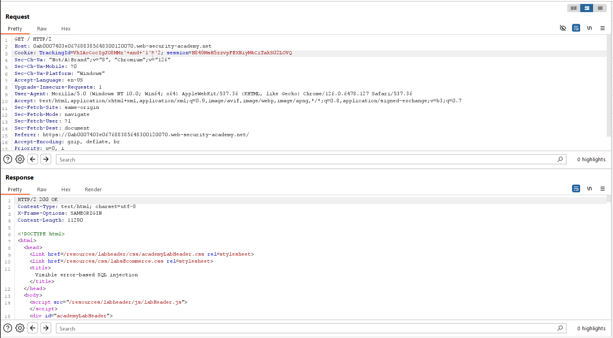
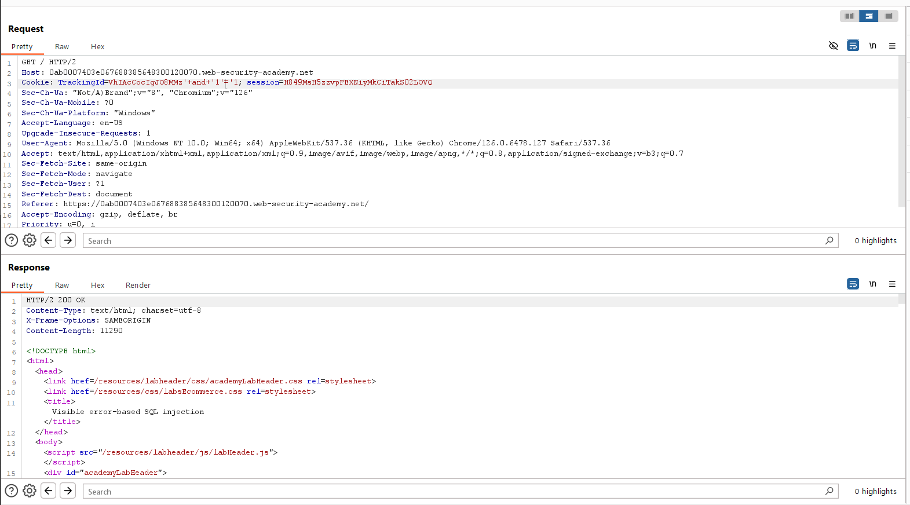
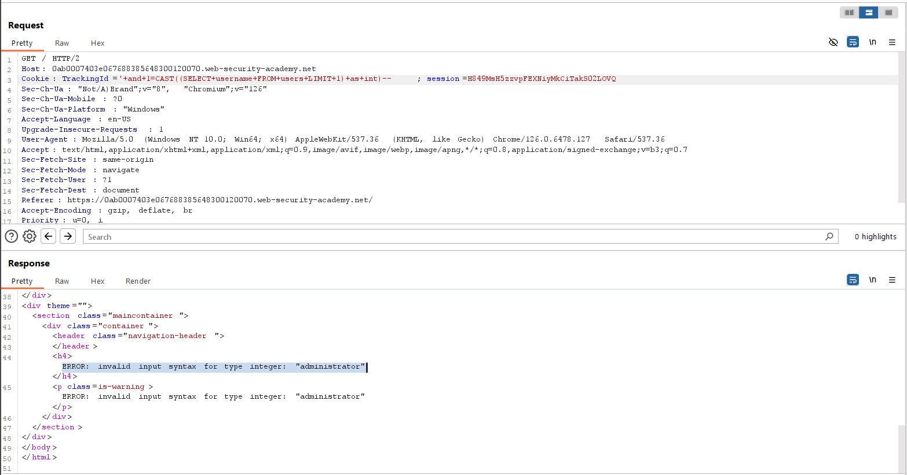
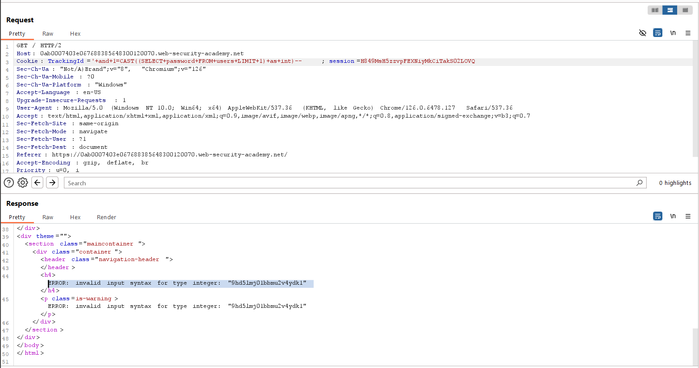
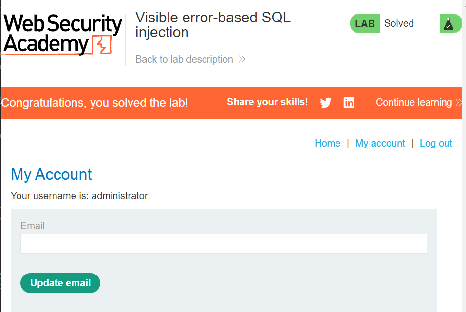

# Visible error-based SQL injection
***


+ Lab chứa lỗ hổng SQL SQL. Ứng dụng sử dụng cookie theo dõi để phân tích và thực hiện truy vấn SQL chứa giá trị của cookie đã gửi. Kết quả của truy vấn SQL không được trả về. Database có một bảng là users và 2 cột là username và password

+ Mục tiêu của lab này là: tìm cách rò rỉ mật khẩu cho người dùng administrator, sau đó đăng nhập vào tài khoản của họ.

+ Đầu tiên ta sẽ thử thêm vào trang web câu truy vấn luôn sai và luôn đúng xem phản hồi của trang web
  




Trang web đều trả về status 200, điều đó cho thấy điều kiện trong câu truy vấn là đúng hay sai đều không ảnh hưởng gì tới bài lab lần này. Bây giờ ta sử dụng hàm cast để chuyển dữ liệu String về int để khiến ứng dụng tạo ra thông báo lỗi có chứa một số dữ liệu được truy vấn trả về



Trang web trả về lỗi khi chuyển username administrator về kiểu dữ liệu int, vậy là ta biết được username là administrator. Tiếp theo ta sẽ chuyển password về kiểu dữ liệu int để xem kết quả trả về của câu truy vấn:



Vậy là ta nhận được password trả về là: ```9hd5lmj01bbmu2v4ydk1```

