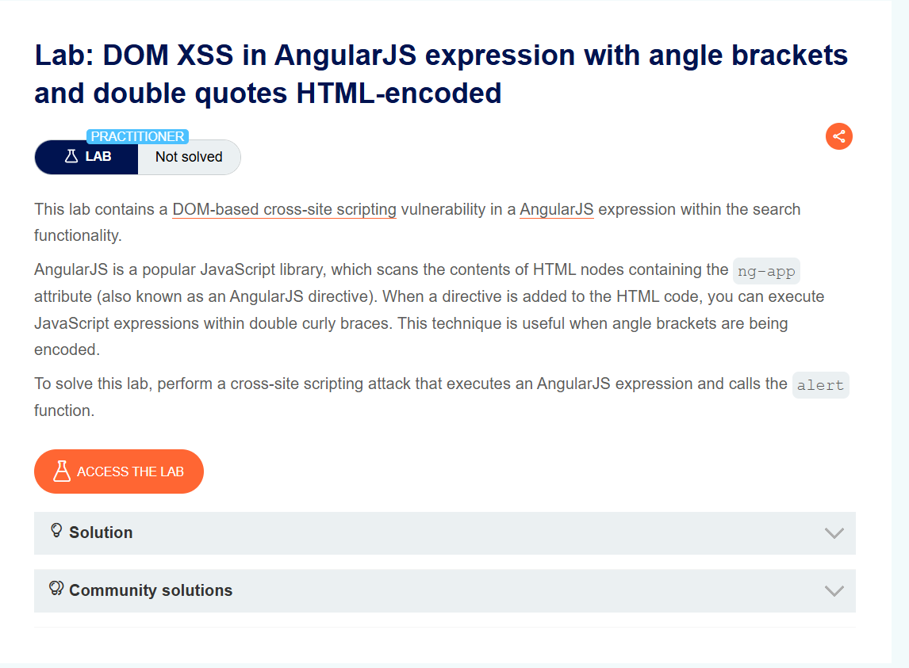

## DOM XSS in AngularJS expression with angle brackets and double quotes HTML-encoded
***


+ Bài lab này chứa lỗ hổng tập lệnh chéo trang dựa trên DOM trong biểu thức AngularJS trong chức năng tìm kiếm. AngularJS là một thư viện JavaScript phổ biến, dùng để quét nội dung của các nút HTML chứa thuộc tính ng-app (còn được gọi là chỉ thị AngularJS). Khi một lệnh được thêm vào mã HTML, bạn có thể thực thi các biểu thức JavaScript trong dấu ngoặc nhọn đôi. Kỹ thuật này rất hữu ích khi dấu ngoặc nhọn được mã hóa.
+ Nhập thử đoạn mã ```<script> alert(1)> </script>``` không có điều gì xảy ra nên mình thử xem source:


+ Dễ thấy nó sử dụng công nghê angular 1-7-7. Nó nhận {{}} để thực thi đoạn mã javascript. Để kiếm chứng mình thử nhập vào {{1+1}} thì nhận được kết quả trả vể là 2:


+ Sau khi xác thực nó là angular mình chèn đoạn mã xss vào: ```{{constructor.constructor("alert(1)")()}}``` đoạn mã này sử dụng hàm khởi tạo trong angular để có thể thực thi đoạn mã javascript bên trong ngoặc tròn

