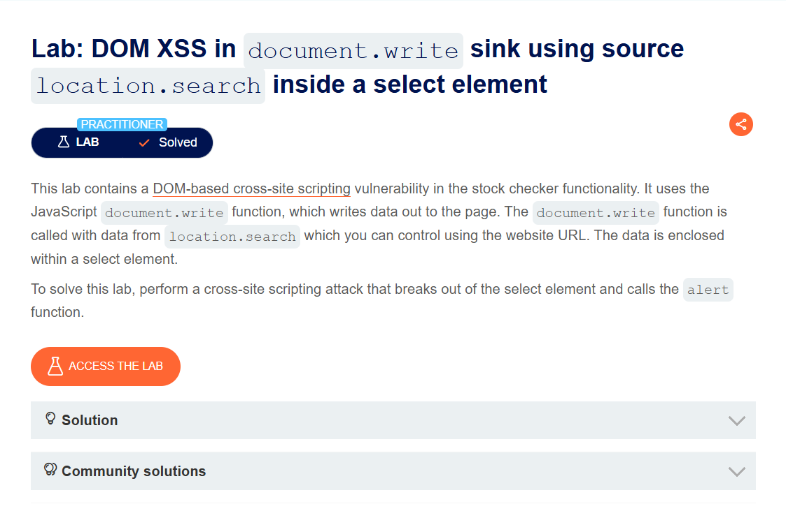
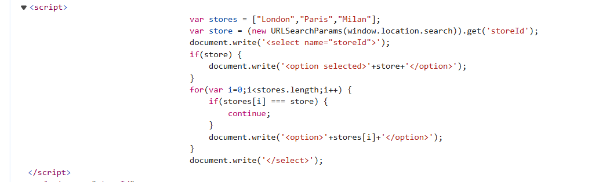
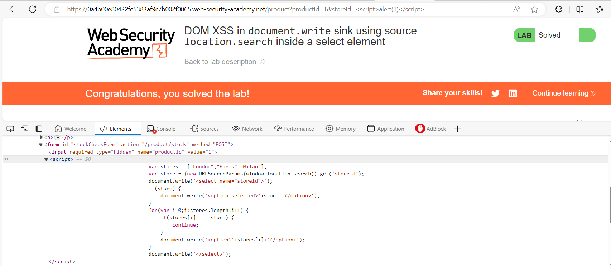

## DOM XSS in document.write sink using source location.search inside a select element
***


+ Bài lab này chứa lỗ hổng DOM XSS trong chức năng check stock. Nó sử dụng hàm document.write của JavaScript để ghi dữ liệu ra trang. Hàm document.write được gọi với dữ liệu từ location.search mà bạn có thể kiểm soát bằng URL trang web. Dữ liệu được đặt trong một phần tử được chọn. Click vào check stock và kiểm tra source:



+ Dễ thấy đoạn mã script trên nó sẽ xử lý khi trên thanh url có para storeId và ghi nó vào thẻ Option. Vì thể mình đã thử thêm nó vào url và nó in ra thật ```&storeId=<script>alert(1)</script>```:

