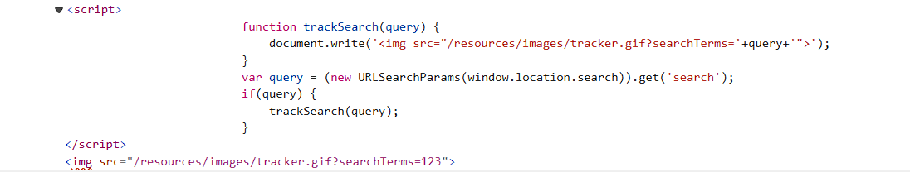

## DOM XSS in document.write sink using source location.search
***


+ Kiểm tra chức năng search với một chuỗi ngẫu nhiên:



+ Ở ngay source code điều làm mình để ý ở đây đó là đoạn mã script, đoạn mã lấy có biến query lấy giá trị search từ url thông qua hàm URLSearchParams(). Nếu query không rống nó sẽ gọi đến hàm tracksearch và sử dùng hàm document.write để ghi nội dung ```document.write('');```. Do nội dung của query mình có thể thay đổi được nên mình thử đổi query thành ```"><script>alert(1)</script>" ```khi đó mình sẽ có payload là:
```document.write(' <script>alert(1)</script>');```


