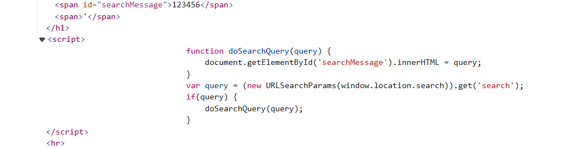

## DOM XSS in innerHTML sink using source location.search
***


+ Trang web có tính năng tìm kiếm quen thuộc. Thực hiện tìm kiếm 1 vài chuỗi đơn giản và xem cách xử lý của ứng dụng



+ Tại phần source code, nó cho mình 1 đoạn js xử lý, xử dụng biến query đế lấy giá trị search của url thông qua hàm URLSearchParams, nếu query không rỗng thì nó sẽ gọi đến hàm doSearchQuery. Nhập các  ```<script>alert(1)</script>``` không thấy đoạn mã js được thực thi. Lý do chính mà các trình duyệt hiện đại không cho phép sử dụng các phần tử ```<script>``` trong innerHTML là để ngăn chặn các cuộc tấn công Cross-Site Scripting (XSS).

 

+ Điều này có nghĩa là bạn sẽ cần sử dụng các phần tử thay thế như  img hoặc  iframe. Các trình xử lý sự kiện như  onload và  onerror có thể được sử dụng cùng với các phần tử này. Sử dụng payload sau: ``````

