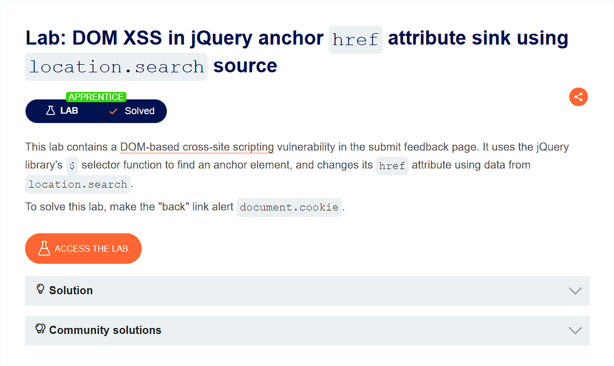
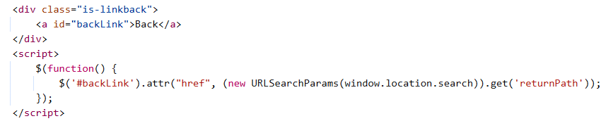

## DOM XSS in jQuery anchor href attribute sink using location.search source
***


+ Lab này có chứa lỗ hổng DOM-based XSS ở trang submit feedback. Nó sử dụng chức năng lựa chọn $ của thư viện jQuery để tìm một thẻ ```<a>``` và đổi thuộc tính href sử dụng dữ liệu từ location.search. Để solve lab này thì em cần đưa link “back” hiện ra document.cookie

+ Đầu tiên mình cần phải xem xét tính năng submit feedback của trang web đã:





+ Đoạn mã  ```<script> $(function() {$('#backLink').attr("href", (new URLSearchParams(window.location.search)).get('returnPath'));});</script>``` Có chức năng  như tìm kiếm một thẻ ```<a>``` có id là backLink và thay thế thuộc tính href của nó bằng tham số returnPath được lấy từ trên thanh url. Vì returnPath mình có thể thực hiện thay đổi nó được. Vì thế mình sẽ thay đổi returnPath thành``` ?returnPath=Javascript:alert(document.cookie) ```và chạy thử đoạn mã


