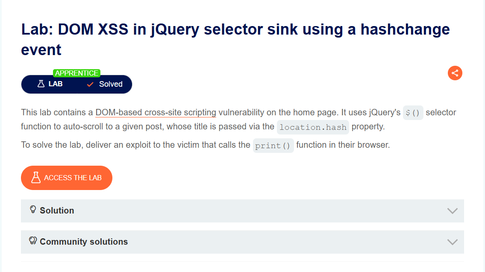
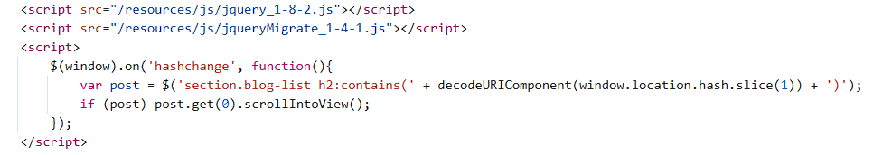
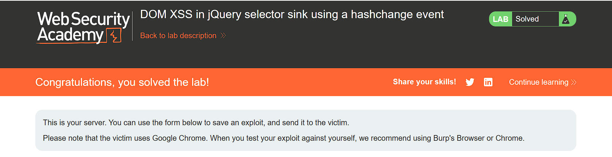

## DOM XSS in jQuery selector sink using a hashchange event
***


+ Bài lab này chứa lỗ hổng [DOM-based cross-site scripting](https://portswigger.net/web-security/cross-site-scripting/dom-based). Nó sử dụng hàm chọn $() của jQuery để tự động cuộn đến một bài đăng nhất định, có tiêu đề được chuyển qua thuộc tính location.hash. Để giải quyết bài lab này, mình phải cung cấp một khai thác cho nạn nhân gọi hàm print() trong trình duyệt của họ.
+ Như mọi bài đầu tiên khi vào bài lab mình mở dev-tool để xem source code. chúng ta có một đoạn mã script:



+ ```$(window).on('hashchange', function(){...``` Với phần này mình lắng nghe sự kiện hashchange. Nói cách khác, khi vị trí băm(#) trong URL được kích hoạt, mã này sẽ được thực thi. ```decodeURIComponent(window.location.hash.slice(1))``` dùng để xóa # ra khỏi chuỗi. Ngoài ra, decodeURIComponent được sử dụng để giải mã các ký tự được mã hóa URL. ```var post = $('section.blog-list h2:contains(...)')``` Trong phần này, việc tìm kiếm được thực hiện trong trang HTML. Các phần có thẻ h2 trong lớp “section.blog-list” được xác định và gán biến “post”. Ký hiệu # đã bị xóa và nội dung được mã hóa URL đã được giải mã. Nội dung tìm kiếm được tìm thấy và gán cho biến bài đăng.x
+ Với ```if (post) post.get(0).scrollIntoView()``` phần này, nếu biến post không trống, nghĩa là từ được tìm thấy đã được tìm thấy, hàm ScrollIntoView được sử dụng để đưa trang đến vị trí tìm thấy từ đó. Như vậy mình đã hiểu được sương sương nội dung của mã scripts, mình thử chèn vào nó đoạn mã script: ```<#'"> </iframe>```
+ ```https://ip.web-security-academy.net/#``` Trong dòng này, iframe được tạo và thuộc tính src được đặt thành URL. URL kết thúc bằng ký hiệu #, hướng trang web mục tiêu đến một phần bên dưới URL. ```onload="this.src+=''"``` sự kiện onload được kích hoạt khi nội dung của iframe được tải đầy đủ . Khi sự kiện onload được kích hoạt, biểu thức this.src được sử dụng để sửa đổi thuộc tính src của iframe. Việc sửa đổi nhằm mục đích đưa thẻ img độc hại vào trang web được tải trong iframe.
  
