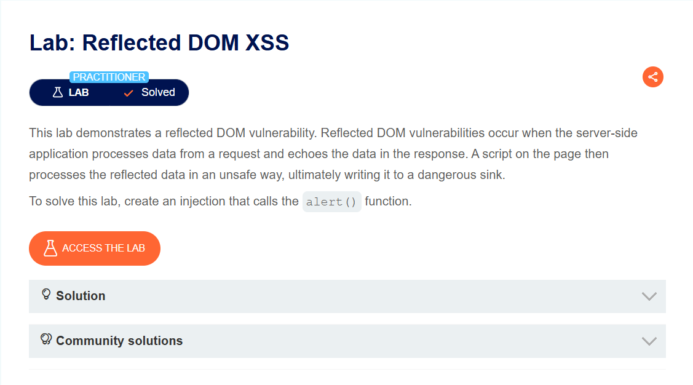
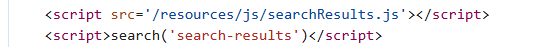
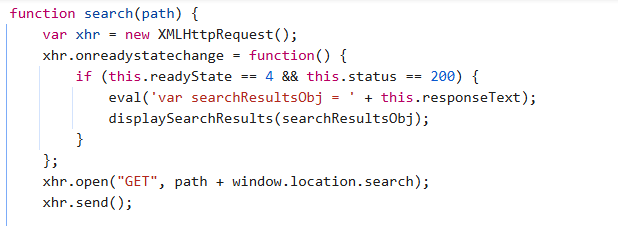
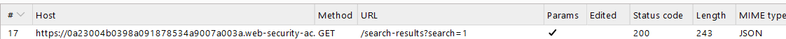
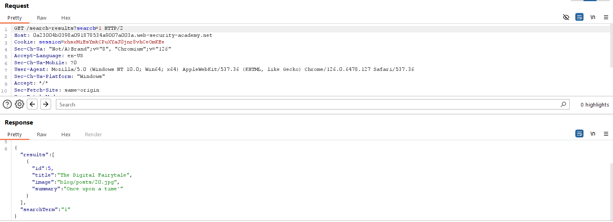
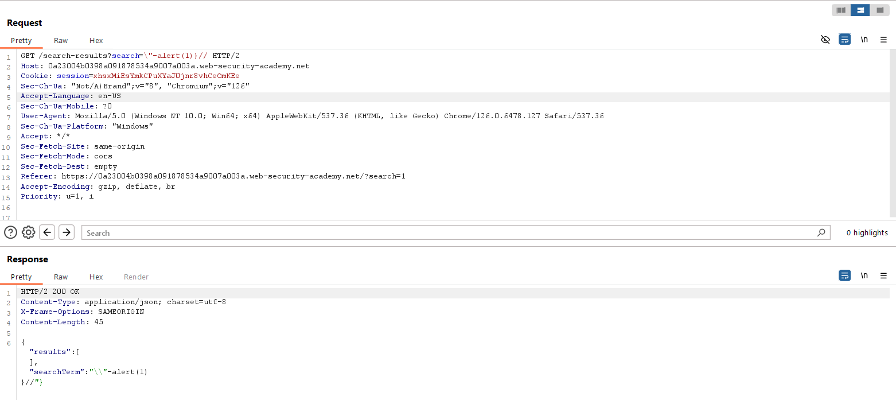

## Reflected DOM XSS
***

+ Lab trên đưa ra một minh chứng cho lỗ hổng reflected DOM XSS. Lỗi này xảy ra khi phía server xử lý dữ liệu từ một request và hiện ra lập tực dữ liệu ở trong response. Có một script ở trang web mà xử lý dữ liệu của data vừa nhập một cách không an toàn, từ đó làm trang web đối diện với nguy cơ bị tấn công cao. Để solve lab thì em sẽ thực hiện chức năng alert() ở trang web
+ Thực hiện xem source code mình thấy có đoạn mã script gọi đến địa chỉ /resources/js/searchResults.js và 1 đoạn mã gọi đến hàm search

+ Thực hiện truy cập vào địa /resources/js/searchResults.js:

+ Có thể thấy hàm eval() thực thi đoạn mã mà không qua bất kỳ câu lệnh nào. Và respontext lấy dữ liệu phản hồi dưới dạng chuỗi (Json)
+ Mình sẽ thực hiện tính năng search và thực hiện quan sát trên burp suite:

+ Như đã phân tích trước đó thì kết quả nó trả về json thật. Bây giờ mình sẽ thực hiện bypass qua nó bằng việc thêm \ và kết thúc ngoặc rồi mới thực hiện tiếp câu lệnh, payload đầy đủ là \"-alert(1)}// -> vì json không thể xử lý được thằng " đầu tiên nên nó sẽ thêm một dấu \ vào , từ đó tạ thành 2 dấu \\, dấu - để ngăn cách giữa biểu thức trước và chức năng alert của em, sau đó đóng ngoặc để kết thúc JSON và // sẽ comment hết đoạn đằng sau, cụ thể thì responds sẽ là

