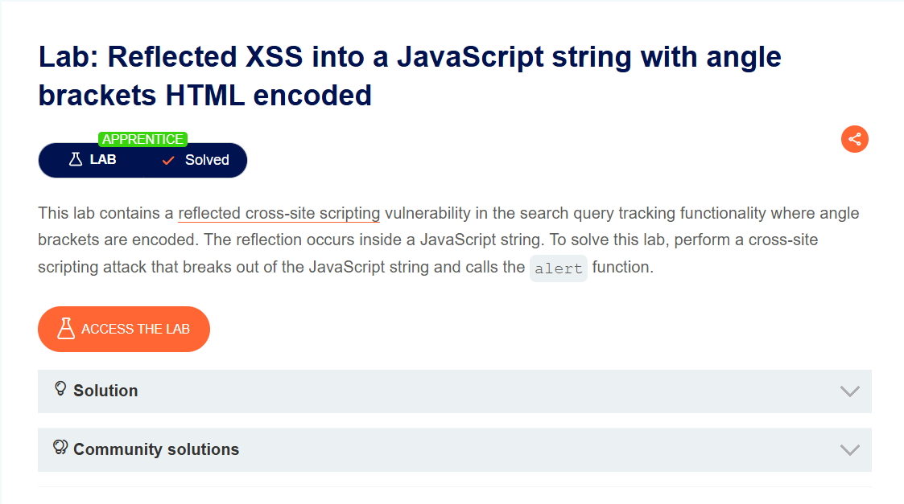
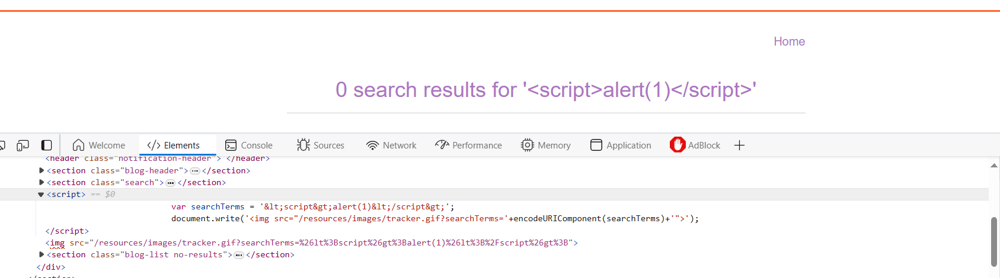
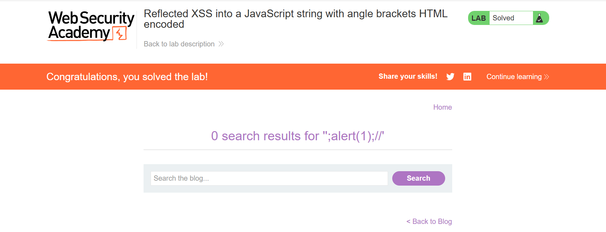

## Reflected XSS into a JavaScript string with angle brackets HTML encoded
***

+ Vẫn là bài lab liên quan đến với chức năng search, mình thử thêm 1 đoạn mã script:

+ Vẫn như bài lab trước nó có mã hóa <> nhưng không mã hóa dấu nháy. Mình đã chèn thử như này 'onerror='alert("XSS")'' nhưng không hiệu quả. Vì vậy mình thử payload ';alert(1);//' khi đó var searchTerms = ';alert(1);//'; và đoạn mã đã được thực thi:

