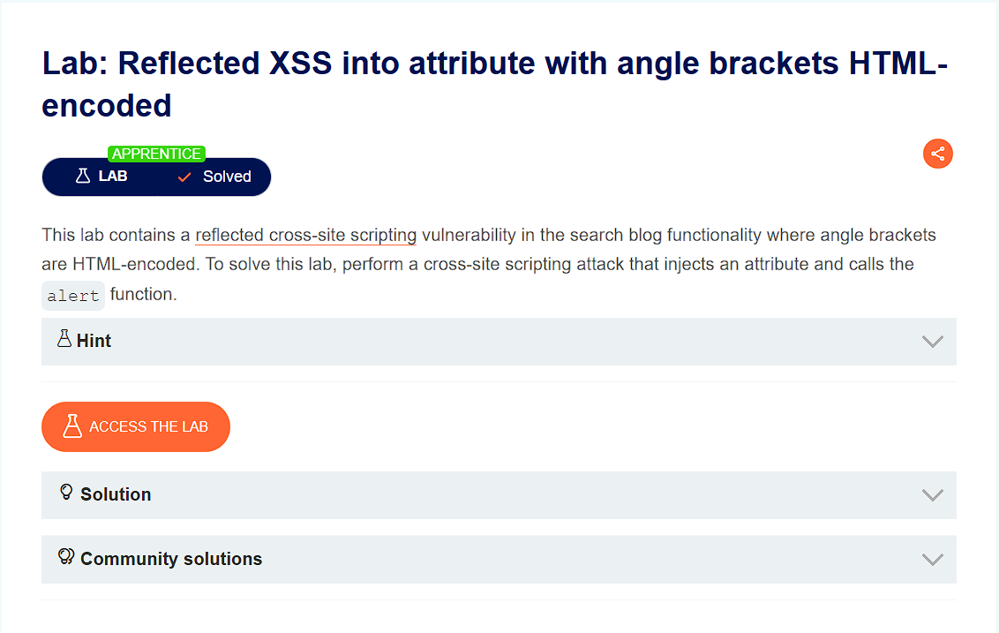
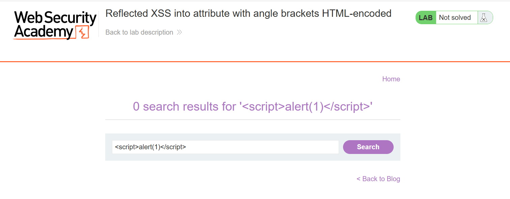
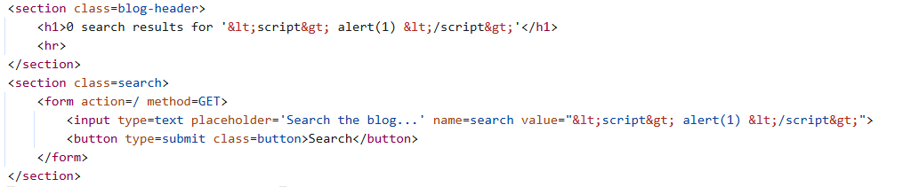
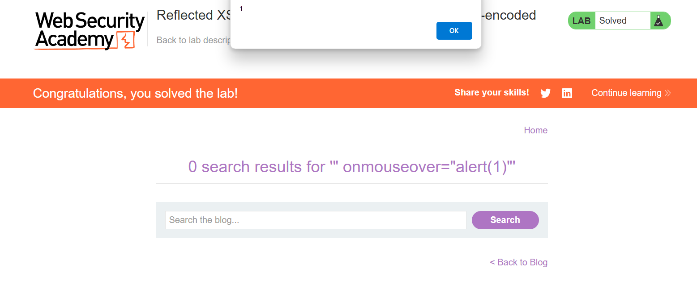

## Reflected XSS into attribute with angle brackets HTML-encoded
***


+ Đăng nhập vào bài lab mình có thấy nó có một chức năng search, mình thử chèn vào nó đoạn mã script ```<script>alert('1')</script>``` nhưng không thành công:



+ Mình sẽ check source. Nếu để ý kĩ trong source thì ta sẽ thấy chuỗi tìm kiếm đã được chuyển vào value và mã hóa đi các dấu đóng mở:



+ Vì đoạn code nó chỉ xử lý dấu <> chứ không xử lý dấu nháy nên mình sẽ thử chèn với payload ```"onmouseover="alert(123)"``` có nghĩa là sau đó value sẽ thành ```value=""onmouseover="alert(123)"```. Và thông báo này được xảy ra khi mình di chuột vào một phần tử:

