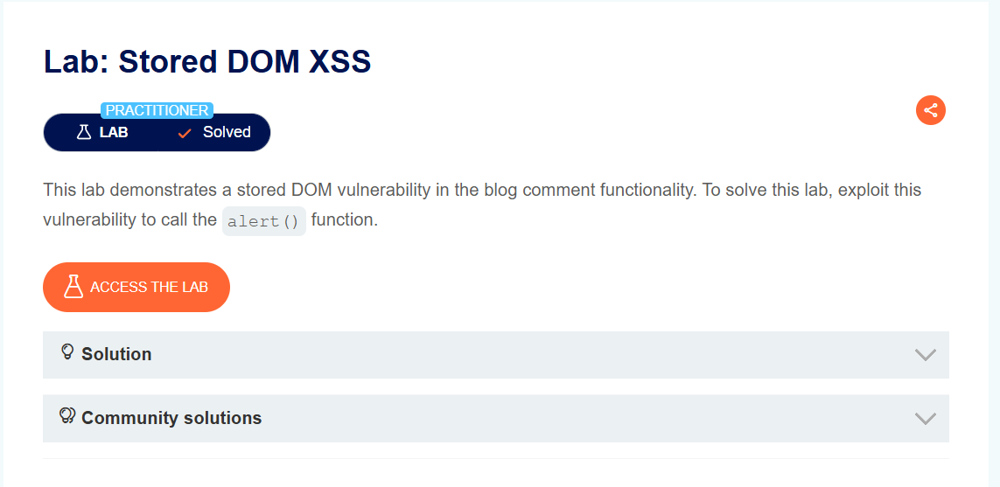
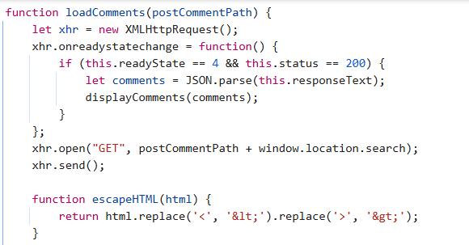

## Stored DOM XSS
***


+ Lab này có chứa lỗ hổng stored DOM XSS ở chức năng bình luận, để solve lab thì mình cần khai thác lỗ hổng để sử dụng chức năng alert()

+ Tại chức năng bình luận của các bài viết mình có gửi đi một comment dạng ```<script> alert(1) </script>``` nhưng khi đăng lên thì nó chỉ còn ```<script>alert(1)```

+ Xem source thì mình thấy có 1 đoạn code:



Nó encode những kí tự <> nhưng có vẻ như nó chỉ mã hóa những kí tự đầu tiên nên phần sau không được encode nên nó đã biến mất. Nên mình sẽ để chống <> đầu và payload của cặp sau là:```<>```


