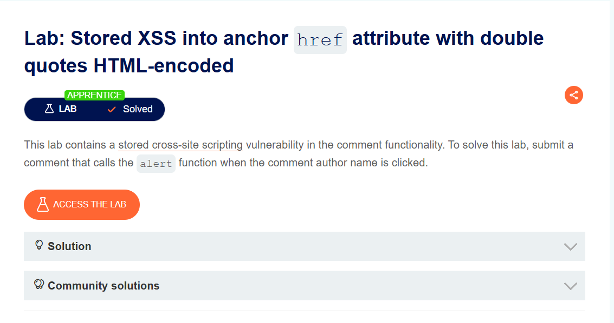
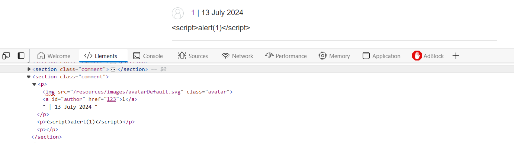
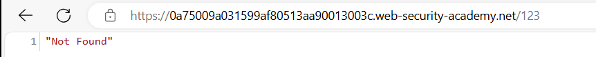
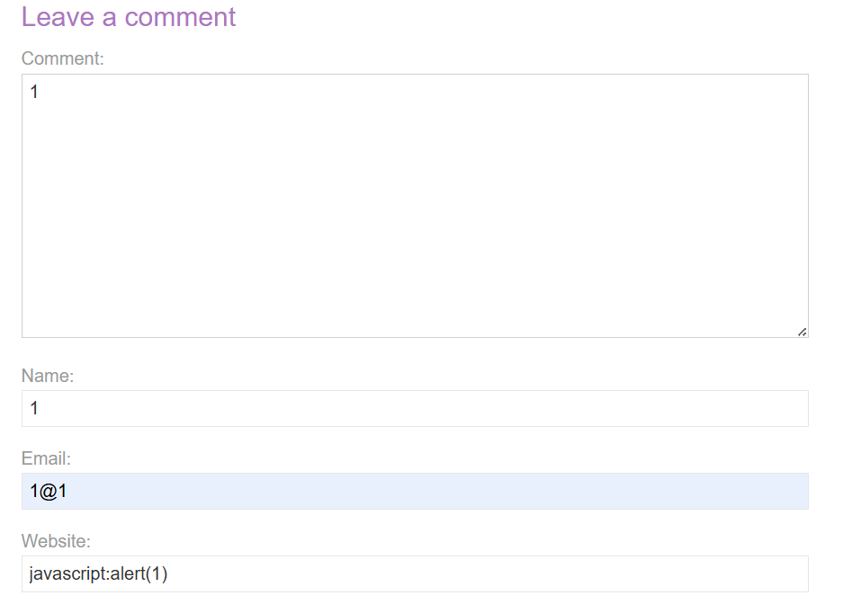
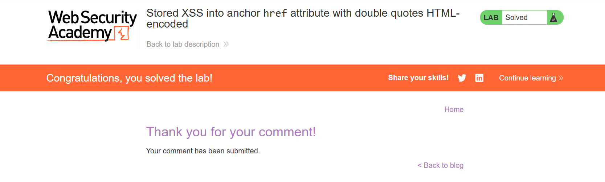

## Stored XSS into anchor href attribute with double quotes HTML-encoded
***

+ Mình sẽ vào bất kì 1 post nào và lại test lại chức năng comment.

+ Sau khi load trang thì không thấy thông báo bật lên có thể một vài ký tự đã được lọc.
+ Mình có để ý là thẻ a href có đường dẫn đến website đã nhập ở input website. Mình thử truy cập vào nó thì được thông báo not found:

+ Như vậy mình sẽ inject script vào href của thẻ a tức là chèn vào input website:

